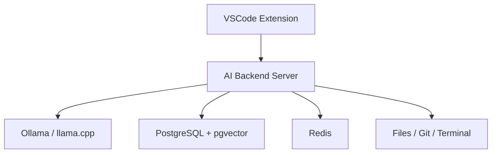

# Architecture

Arc is intentionally split into three independently evolvable components.

## VSCode Extension

The extension is a thin product adapter. It owns VSCode-specific UX and permissions:

- Chat panel and webview UI.
- Inline completion provider.
- Code actions.
- Diff preview and approval UI.
- Workspace identity and editor state.

The extension must not own LLM orchestration, memory, embedding, or tool execution policy.

## AI Backend Server

The NestJS backend is the durable product core. It owns:

- LLM provider orchestration.
- Prompt and context assembly.
- Tool calling.
- Repository indexing.
- Semantic search.
- Memory.
- Git and terminal adapters.
- Permission enforcement.

Milestone 1 exposes a `/health` endpoint and a Socket.IO gateway so clients can verify the
backend is reachable before chat features are added.

## Inference Provider Boundary

Milestone 2.1 introduces an `InferenceModule` with a provider-neutral `ChatModelPort`. The
application layer exchanges messages, text deltas, completion metadata, readiness states, and typed
errors only. Ollama's HTTP endpoints and newline-delimited JSON stream format are contained inside
the Ollama adapter.

This keeps the backend's future chat orchestration independent from a specific inference runtime.
Ollama is the first adapter; llama.cpp or another local provider can implement the same port without
changing the caller. The backend liveness endpoint remains separate from Ollama readiness at
`/providers/ollama/status`, so clients can distinguish a stopped Arc server from an unavailable or
misconfigured model.

## Streaming Chat Protocol

Milestone 2.2 adds a dedicated Socket.IO `/chat` namespace. Clients submit `chat:send` and
`chat:cancel` commands, while the backend emits `chat:accepted`, `chat:delta`,
`chat:completed`, `chat:cancelled`, and `chat:error` events. Every event is correlated by request
and session identifier and validated with shared Zod contracts.

The `ChatGateway` owns transport concerns only. `SendChatMessageService` invokes the provider port,
and `ActiveGenerationRegistry` holds cancellable in-memory work for one connected client and
session. The registry is deliberately not a conversation store: completed messages disappear on
restart until durable sessions are added in Milestone 2.5.

## Local Infrastructure

Infrastructure is added only when a milestone needs it. PostgreSQL, pgvector, Redis, Ollama, and
embedding workers belong here, not inside the VSCode extension.

## Boundary Rule

The backend should be usable by future clients such as a CLI, web dashboard, JetBrains plugin, or
automation runner. VSCode is the first client, not the platform boundary.
