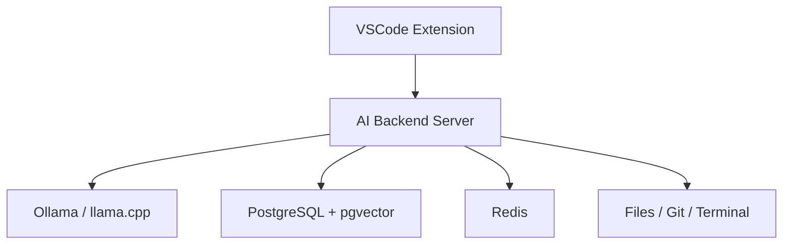

# Architecture

Arc is intentionally split into three independently evolvable components.

## VSCode Extension

The extension is a thin product adapter. It owns VSCode-specific UX and permissions:

- Chat panel and webview UI.
- Inline completion provider.
- Code actions.
- Diff preview and approval UI.
- Workspace identity and editor state.

The extension must not own LLM orchestration, memory, embedding, or tool execution policy.

## AI Backend Server

The NestJS backend is the durable product core. It owns:

- LLM provider orchestration.
- Prompt and context assembly.
- Tool calling.
- Repository indexing.
- Semantic search.
- Memory.
- Git and terminal adapters.
- Permission enforcement.

Milestone 1 exposes a `/health` endpoint and a Socket.IO gateway so clients can verify the
backend is reachable before chat features are added.

## Local Infrastructure

Infrastructure is added only when a milestone needs it. PostgreSQL, pgvector, Redis, Ollama, and
embedding workers belong here, not inside the VSCode extension.

## Boundary Rule

The backend should be usable by future clients such as a CLI, web dashboard, JetBrains plugin, or
automation runner. VSCode is the first client, not the platform boundary.
