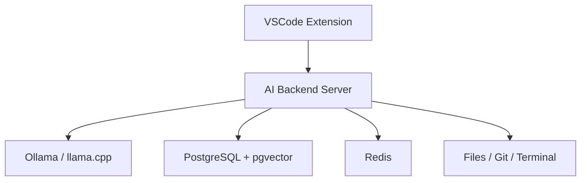
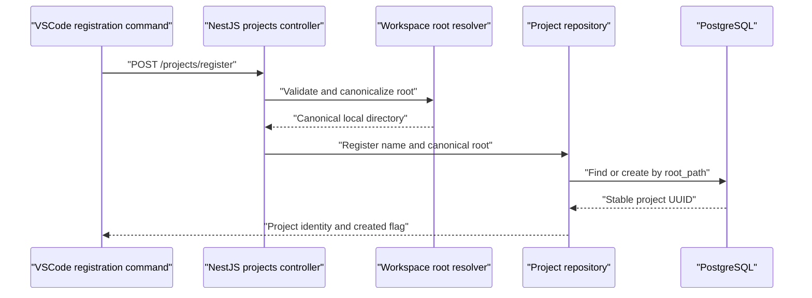
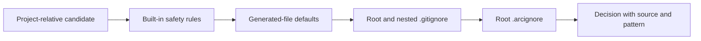
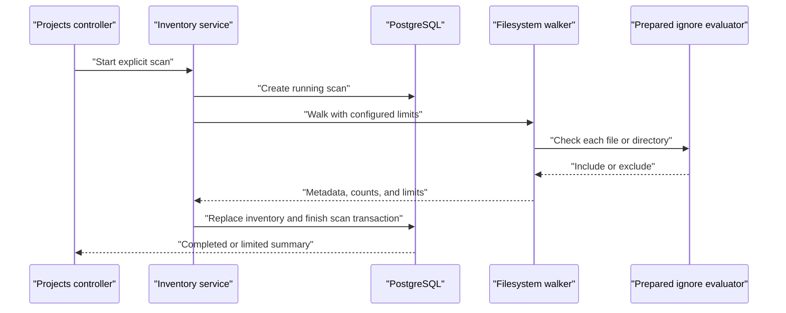
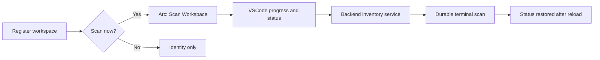
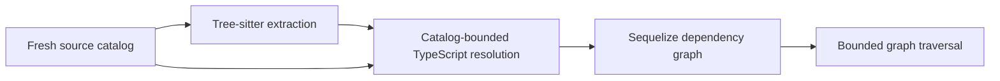
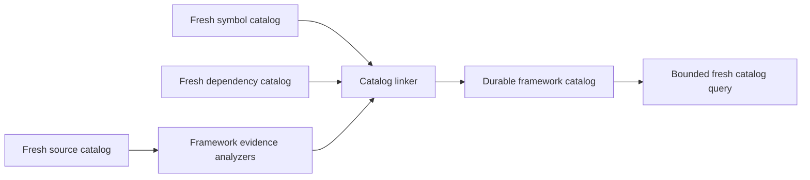

# Architecture

Arc is intentionally split into three independently evolvable components.

## VSCode Extension

The extension is a thin product adapter. It owns VSCode-specific UX and permissions:

- Chat panel and webview UI.
- Inline completion provider.
- Code actions.
- Diff preview and approval UI.
- Workspace identity and editor state.

The extension must not own LLM orchestration, memory, embedding, or tool execution policy.

## AI Backend Server

The NestJS backend is the durable product core. It owns:

- LLM provider orchestration.
- Prompt and context assembly.
- Tool calling.
- Repository indexing.
- Semantic search.
- Memory.
- Git and terminal adapters.
- Permission enforcement.

Milestone 1 exposes a `/health` endpoint and a Socket.IO gateway so clients can verify the
backend is reachable before chat features are added.

## Inference Provider Boundary

Milestone 2.1 introduces an `InferenceModule` with a provider-neutral `ChatModelPort`. The
application layer exchanges messages, text deltas, completion metadata, readiness states, and typed
errors only. Ollama's HTTP endpoints and newline-delimited JSON stream format are contained inside
the Ollama adapter.

This keeps the backend's future chat orchestration independent from a specific inference runtime.
Ollama is the first adapter; llama.cpp or another local provider can implement the same port without
changing the caller. The backend liveness endpoint remains separate from Ollama readiness at
`/providers/ollama/status`, so clients can distinguish a stopped Arc server from an unavailable or
misconfigured model.

## Streaming Chat Protocol

Milestone 2.2 adds a dedicated Socket.IO `/chat` namespace. Clients submit `chat:send` and
`chat:cancel` commands, while the backend emits `chat:accepted`, `chat:delta`,
`chat:completed`, `chat:cancelled`, and `chat:error` events. Every event is correlated by request
and session identifier and validated with shared Zod contracts.

The `ChatGateway` owns Socket.IO correlation and event emission. `SendChatMessageService` invokes
the provider port, while `DurableChatService` owns the durable request lifecycle. The active
generation registry holds only cancellable in-memory work and permits one generation per durable
session; it is not a conversation store.

## Webview Boundary

Milestone 2.3 gives the Arc activity-bar view a React and Tailwind UI that is bundled by Vite into
local extension assets. The webview has no network permission: it exchanges validated messages with
the extension host, which owns HTTP calls to the local backend. The initial bridge reports backend
and Ollama readiness only. It uses a nonce-based content security policy and allows scripts and
styles exclusively from the extension's generated webview assets.

## Ephemeral Chat State

Milestone 2.4.1 extends the webview bridge with validated chat lifecycle messages. The extension
host owns a single in-memory session, including request IDs, pending assistant placeholders, and
terminal generation states. A webview receives a hydration snapshot whenever it becomes ready, so
closing or reloading the view does not discard the Extension Host's temporary conversation.

This state is deliberately local and non-durable. The webview cannot open a transport connection or
choose correlation IDs; Socket.IO transport is added in Milestone 2.4.2, and persistent sessions
are deferred to Milestone 2.5.

## Extension Chat Transport

Milestone 2.4.2 introduces a provider-neutral `ChatTransportPort` in the extension host and a
Socket.IO implementation for the backend `/chat` namespace. The transport validates every backend
event against the shared contracts before the session controller can use it. The session controller
sends only the current user prompt and correlation identifiers; the backend owns retained context.
It forwards normalized lifecycle updates to the webview.

The Socket.IO client connects lazily when the Arc view becomes ready and uses bounded automatic
reconnection. A disconnect fails the active local generation with a retryable error; it never
silently repeats a user prompt.

## Streaming Chat Presentation

Milestone 2.4.3 presents the normalized session snapshot in the Arc webview. The React view renders
plain-text user and assistant messages, including pending, streaming, completed, cancelled, and
failed states. Its composer emits only validated bridge commands and is disabled while offline
or while a generation is active; Stop forwards a cancellation request to the extension host.

The conversation follows new streaming output until the user scrolls away, keeping a narrow sidebar
usable without fighting deliberate review of earlier messages. The webview remains a projection of
extension-host state, so its reload hydration behavior and transport ownership are unchanged.

Milestone 2.6 renders assistant Markdown through an allowlisted pipeline. Syntax highlighting runs
before sanitization so only approved `language-*` and `hljs-*` classes reach React; raw HTML and
remote images remain disabled. Code-copy and external-link clicks cross the validated webview bridge,
while the extension host owns the clipboard and opens only credential-free HTTP or HTTPS URLs.

Streaming deltas are coalesced into short webview updates before they reach the React reducer. Stable
message objects are memoized, and the Markdown/highlighting pipeline is loaded as a separate chunk on
first use. The conversation follows output only while the viewport remains near the bottom; scrolling
away pauses movement and exposes an explicit jump-to-latest action.

## Integration and Resilience

Milestone 2.4.4 proves the prompt-to-token flow with a deterministic in-process model test spanning
the NestJS gateway and extension-host session controller. It covers ordered deltas, correlated
cancellation, and timeout normalization without requiring a local model during automated tests.

The extension transport exposes `idle`, `connecting`, `connected`, `reconnecting`, and `offline`
states. Socket.IO performs at most four automatic reconnect attempts with deterministic exponential
backoff starting at 500 ms and capped at 5 seconds. Exhaustion moves the transport to `offline`; the
webview can explicitly restart the connection through the validated `chat:reconnect` bridge command.

On backend loss, the extension marks the active assistant message as a retryable failure and leaves
the session available for an explicit future prompt. Reconnecting never re-emits an earlier
`chat:send` command, so a backend restart cannot create a duplicate generation. The backend retains
ownership of the configured Ollama request timeout, which defaults to 300 seconds. A 330-second
extension-host watchdog is reset by accepted and delta events, cancels a silent request on expiry,
and provides a final client-side guard if a terminal backend event is lost.

The webview maps typed backend, provider, model, timeout, cancellation, and connection errors to a
small set of stable user-facing messages. Unknown error details are not rendered, preventing
transport or provider internals from leaking into the chat surface. The terminal smoke commands and
manual test matrix document the matching Ollama and Arc-view checks for a local machine.

## Privacy-Safe Chat Logging

The chat gateway owns lifecycle logging because it observes the complete durable generation without
requiring prompt or response text in its log context. Each generation records its request ID,
session ID, elapsed milliseconds, new-or-existing mode, lifecycle status, and typed terminal error
code when applicable. Cancellation requests and rejected commands use the same content-free
correlation fields.

Prompt content, accumulated assistant output, model messages, and raw persistence error messages
are excluded. Persistence failures record only the JavaScript error type because database error
messages may include query values. Invalid correlation fields are reduced to `unknown` unless they
match the bounded identifier character set.

## Durable Conversation Foundation

Milestone 2.5.1 introduces PostgreSQL as the planned authority for conversation history without
changing the current ephemeral chat flow. The `chat_sessions` table owns the durable session title,
timestamps, and monotonically allocated message order. `chat_messages` stores the user and assistant
records for a request, including cancelled and failed terminal states with structured errors.

Migrations are ordered SQL files applied by an explicit CLI command. The backend does not mutate the
schema during startup. The shared conversation contracts describe the future REST snapshots and
retain the message identifiers and request correlation needed when the gateway becomes durable in
Milestone 2.5.3.

## Conversation Repository

Milestone 2.5.2 adds a repository port behind Nest services for session lifecycle and assistant
generation state. The backend uses a small Sequelize database registry with factory-defined
`chatSessions` and `chatMessages` models, followed by their association in one central model index.
This deliberately mirrors the application's established Sequelize style without introducing a
second Nest-specific model abstraction. Future REST controllers and the realtime gateway consume the
services rather than querying tables directly.

Creating a turn locks its session row, first checks the `(session_id, request_id)` pair, then
allocates adjacent durable message ordinals in the same transaction. A repeated request ID returns
the original user and assistant records instead of creating a second turn. Assistant output moves
from `pending` to `streaming` and one terminal state through a single update path. On recovery, any
pending or streaming assistant messages become retryable `generation_failed` records.

Schema changes stay in the explicit migration runner. The backend can additionally call the
non-destructive `sequelize.sync()` at startup only when `ARC_DATABASE_SYNC=true`; it never enables
`alter` or `force`. This is a local model-table bootstrap aid, not a substitute for applying the
versioned SQL migrations. On startup the connection and optional sync failures are non-fatal, while
the migration command fails clearly if the database cannot be updated.

Milestone 2.5.2 kept this layer independent from the gateway so its database behavior could be
tested in isolation. Milestone 2.5.3 now composes it into the durable transport below.

## Durable Chat Transport

Milestone 2.5.3 makes PostgreSQL the authority for a running chat request. `POST /conversations`
creates a session, `GET /conversations` lists sessions, and `GET`, `PATCH`, and `DELETE`
`/conversations/:sessionId` provide snapshot, rename, and deletion operations for future clients.
The gateway accepts only `{ sessionId, requestId, content }`; it does not accept client-supplied
conversation history.

Before accepting a request, `DurableChatService` ensures the UUID session exists, persists the
completed user message and a pending assistant message, and loads the latest completed turns as
model context. Each emitted delta is stored as `streaming` first, then the assistant record becomes
`completed`, `cancelled`, or `failed` before the corresponding terminal event is emitted. Duplicate
request IDs replay the stored outcome instead of calling the model again.

At backend startup, unfinished assistant records are marked as retryable failures. The extension
host owns the REST client for the session API: when the Arc webview becomes ready, it lists durable
sessions, hydrates the current or newest snapshot, and explicitly creates `New chat` when none
exist. The webview sees only validated bridge events and can create, reopen, rename, or delete
sessions without direct network access. The existing Socket.IO controller continues to own the live
generation state for the selected session.

## Persistence Acceptance

`pnpm db:verify` is the real PostgreSQL acceptance command. It applies pending migrations and uses
two Sequelize connections to verify a session survives a simulated backend restart. The command
checks session creation, request idempotency, streaming and completion states, reopening and
continuing a session, scoped interrupted-generation recovery, listing, rename, and deletion. Its
temporary session is removed in `finally`; recovery is scoped to that session so the command never
changes another active conversation.

## Project Identity and Registration

Milestone 3.1 introduces a durable `projects` record before Arc traverses or indexes a repository.
The VSCode extension registers an explicitly selected local workspace through
`POST /projects/register`; the webview is not involved. The backend resolves the supplied absolute
directory through the operating system, then uses that canonical path as the idempotency key for a
server-generated project UUID.

The extension prefers the active editor's folder in a multi-root window and otherwise asks the user
to choose. It stores the returned project identity in VSCode workspace state as a client-side
reference only; PostgreSQL remains authoritative. Registration stores the project name, canonical
root, UUID, and timestamps. It does not read file contents, apply ignore rules, or trigger a scan.
Those boundaries are introduced independently in Milestones 3.2 and 3.3.

## Workspace Ignore Policy

Milestone 3.2 adds one reusable backend policy for deciding whether a project-relative file or
directory may enter a future repository inventory. Callers provide a registered project UUID, a
portable relative path, and whether the candidate is a file or directory. The service loads the
authoritative project root, normalizes separators, rejects absolute or parent-traversing paths, and
returns an explainable decision through `POST /projects/:projectId/ignore/check`.

Safety and generated defaults are evaluated before project files. Git rules are evaluated from the
root toward the candidate's parent directory, preserving nested rule bases and preventing a child
rule from re-including content below an ignored parent. `.arcignore` is a final additive layer for
Arc-only exclusions; its negations refine its own rules but do not override an earlier exclusion.

Ignore files are read on demand so configuration changes are immediately visible. Only regular
files are accepted, symlinks are not followed, and each rules file is bounded to 1 MiB. Milestone
3.2 does not walk the workspace or persist path decisions. Milestone 3.3 must consume this service
as its sole ignore boundary while building a bounded metadata inventory.

## Bounded Repository Inventory

Milestone 3.3 adds explicit metadata-only scans. A scan prepares one cached ignore evaluator for the
registered project, traverses candidates in deterministic path order, and records only relative
path, byte size, and modification time. Directory entries and `lstat` provide the metadata; Arc
does not open or read candidate file contents.

The walker never follows symbolic links. It stops before exceeding the configured file count or
aggregate byte limit and prunes directories at the depth limit. Hitting any limit produces a usable
`limited` inventory with explicit reasons rather than a generic failure.

`project_scans` owns the `running`, `completed`, `limited`, and `failed` lifecycle. PostgreSQL
allows only one running scan per project. On successful or limited traversal, the repository
deletes the old `project_files`, bulk-inserts the new metadata, and completes the scan in one
transaction. Filesystem or persistence failures update only the scan record, preserving the last
usable inventory. Milestone 3.4 will add client progress, restart recovery, and workflow controls;
incremental watching and content indexing remain later concerns.

## Project Workflow And Recovery

Milestone 3.4 composes registration and inventory without moving backend ownership into VSCode.
After explicit registration, the extension stores the validated project identity by workspace URI
and offers a separate `Scan now` action. `Arc: Scan Workspace` invokes the same path for later
rescans. Multi-root selection prefers the active editor's folder and otherwise asks the user.

The Extension Host owns an indeterminate progress notification and a clickable status-bar item. It
does not infer scan results locally: completed, limited, failed, and interrupted presentations are
derived from shared backend contracts. On activation and active-folder changes, the extension asks
the backend for the latest durable scan and restores that presentation.

If the backend exits during a scan, its `running` row remains durable. On the next backend
bootstrap, `ProjectInventoryService` changes every abandoned scan to `failed` with
`scan_interrupted`; current `project_files` are untouched. Client or persistence failures never
trigger an automatic rescan, preventing hidden filesystem work and duplicate scans.

`pnpm project:verify` is the Milestone 3 local acceptance boundary. It applies migrations, creates a
temporary repository and project, verifies ignore and symlink behavior, performs atomic initial and
replacement scans, simulates restart recovery through a second Sequelize connection, confirms
inventory preservation, and removes all temporary state.

## Source Content Safety and Fingerprints

Milestone 4.1 introduces the first content-aware backend boundary without storing source text.
An explicit source-index run consumes the latest usable metadata inventory, rechecks current ignore
rules, safely reads bounded regular files one at a time, validates UTF-8, and calculates exact-byte
SHA-256 fingerprints. Source bytes are discarded after each outcome and never enter PostgreSQL,
logs, API responses, VSCode, or Ollama.

Fingerprints live in a separate current source catalog rather than on `project_files`. Each
source-index run records the inventory scan it consumed, so a later metadata scan makes the source
catalog observably stale without deleting it. Successful publication atomically upserts current
paths and removes absent paths; failed or restart-interrupted runs preserve the previous catalog.

Tree-sitter parsing, graph construction, source chunks, embeddings, semantic retrieval, and VSCode
index controls remain later gates. The complete design is documented in
`docs/milestone-4.1-architecture.md`.

## Language-Neutral Symbol Extraction

Milestone 4.2 consumes only a fresh Milestone 4.1 source catalog. The backend safely re-reads each
ready file that requires parsing, verifies its SHA-256, and sends transient text through an
Arc-owned Tree-sitter adapter. Unchanged hashes with the same successful parser identity reuse their
durable result without another read. The initial grammar registry supports JavaScript, JSX,
TypeScript, and TSX; parser and query types do not cross the infrastructure boundary.

Symbol indexing stores declaration identifiers, language-neutral kinds, lexical identity keys,
export flags, and source ranges. It does not store syntax trees, bodies, signatures, comments,
literals, or arbitrary source slices. Source hashes plus a parser identity allow unchanged
file-level results to be reused, while grammar or query changes invalidate only affected files.

Changed-file symbols and reused-file ownership are published in one Sequelize transaction. Failed
or restart-interrupted runs preserve the previous symbol catalog, and a newer source-index run makes
that catalog observably stale. The complete design and four implementation gates are documented in
`docs/milestone-4.2-architecture.md`.

Milestone 4.2.1 pins `tree-sitter@0.21.1`, `tree-sitter-javascript@0.23.1`, and
`tree-sitter-typescript@0.23.2`. The compatibility probe confirms native ESM/CJS loading, all four
dialects, query execution, malformed trees, repeated parser reset, and both `tsx` and compiled
execution on Node 24/x64 macOS. This binding reports string-input indices as UTF-16 code units, so
the infrastructure boundary converts offsets and columns to exclusive UTF-8 byte ranges before
later extraction contracts can observe them.

Milestone 4.2.2 adds the parser-neutral `SourceSymbolExtractor` port and Tree-sitter implementation.
Language-specific TypeScript string query packs emit declaration candidates; the adapter owns
context filtering, lexical hierarchy, direct export state, stable occurrence-based identities,
qualified names, limits, syntax-error reporting, and deterministic source order. Its parser
identity includes `arc-symbol-query@1`, so later query changes invalidate reusable file results.

Milestone 4.2.3 adds the durable catalog behind that port. `project_symbol_index_runs` records
source-catalog provenance and terminal counters, `project_symbol_files` owns the current
incremental file state, and `project_symbols` stores only declaration identifiers, kinds, hierarchy,
export state, and normalized ranges. Source-file UUIDs are correlation values rather than foreign
keys, preserving the previous symbol catalog when a newer source index removes a path.

The symbol service accepts only a fresh source catalog, safely re-reads and hash-verifies changed
supported files, and reuses files only when their hash and effective parser identity match.
Publication reassigns reusable symbols, upserts changed outcomes, removes stale rows, and completes
the run in one Sequelize transaction. `POST /projects/:projectId/symbols/index` starts explicit
work, while `GET /projects/:projectId/symbols/index` reports the latest run and current-catalog
freshness. Backend recovery fails abandoned runs without modifying the last published catalog.

Milestone 4.2.4 locks this boundary with `pnpm symbol:index:verify`. The command builds a temporary
project, drives inventory, source, and symbol services through real native parsers and local
PostgreSQL, proves incremental reuse and invalidation, forces a publication rollback and restart
recovery, checks source-body privacy, and removes all temporary database and filesystem state.

## Import and Dependency Graph

Milestone 4.3 reuses Tree-sitter to extract static dependency syntax from fresh JavaScript,
JSX, TypeScript, and TSX source files. A separate TypeScript compiler API adapter resolves
project-local targets against a virtual filesystem built only from Arc's current source catalog,
including bounded in-project compiler configuration and package metadata. Built-in modules,
external packages, local files, and unresolved imports remain explicit classifications.

Extraction results may be reused when source hashes and query identities match, but every edge is
re-resolved on every dependency run. This lets an unchanged importer react correctly when a target
is added, removed, or retargeted by compiler configuration without reparsing its source.

The graph persists module specifiers, binding identifiers, stable relationship keys, source ranges,
relative local targets, and run provenance. It does not persist source bodies, syntax trees,
absolute target paths, or TypeScript failed-lookup paths. Failed and interrupted runs preserve the
previous graph, and Milestone 4.3.4 traversal rejects stale graphs. The complete
design and four implementation gates are documented in `docs/milestone-4.3-architecture.md`.

Milestone 4.3.1 implements the extraction half of this boundary. Versioned JavaScript and
TypeScript Tree-sitter query packs feed a parser-neutral `SourceDependencyExtractor` with static
imports, re-exports, type-only forms, import-equals, direct module-level CommonJS declarations, and
static dynamic imports. The adapter safely decodes string literals, normalizes exclusive UTF-8 byte
ranges, assigns offset-independent dependency and binding identities, and enforces deterministic
limits without persisting source. Resolution and graph persistence remain later gates.

Milestone 4.3.2 implements the resolution half behind a compiler-neutral `ProjectModuleResolver`.
The backend pins TypeScript 5.9.3 and resolves against a catalog-only virtual filesystem: code files
can satisfy existence checks, while only bounded, hash-verified compiler and package metadata can
be read. The adapter selects the nearest project config, honors catalog-backed relative `extends`,
uses distinct import/require modes, and classifies local, built-in, external, and unresolved
relationships without exposing absolute paths or failed lookup locations.

Milestone 4.3.3 adds durable incremental publication. `project_dependency_index_runs` records source
provenance, resolution context, warnings, limits, and terminal counters;
`project_dependency_files` owns reusable extraction state; and `project_dependency_edges` plus
`project_dependency_bindings` store only normalized declarations, classifications, identifiers,
ranges, and relative local targets. Source-file and target UUIDs are opaque correlation values, so
a replacement source catalog cannot partially destroy the previous graph.

The dependency service safely reads changed code and resolver metadata, reuses unchanged
declarations by source hash and effective extractor identity, and re-resolves every current edge.
One Sequelize transaction upserts all current rows, removes stale run-owned rows, and completes the
run. Failed or interrupted work leaves the previous graph intact. Explicit dependency index,
status, and graph endpoints are available.

Milestone 4.3.4 completes the boundary with strict graph contracts and deterministic breadth-first
incoming, outgoing, and bidirectional traversal. Only local file nodes expand; external and
built-in nodes are terminal, unresolved edges have no target, cycles are visited once, and node,
edge, and depth ceilings expose explicit truncation state. Every query is scoped to one immutable
dependency run and rechecks source/dependency freshness before returning.

`pnpm dependency:index:verify` drives a temporary project through real Tree-sitter extraction,
catalog-bounded TypeScript resolution, Sequelize publication, graph traversal, incremental target
and alias changes, rollback, restart recovery, privacy checks, and cleanup against local
PostgreSQL.

## Framework Understanding

Milestone 4.4 combines coherent source, symbol, and dependency provenance into a separate durable
framework catalog. Hash-verified changed files are parsed once through a shared Tree-sitter
framework adapter; unchanged normalized evidence is reusable, but cross-file relationships are
relinked on every run.

Exact package/import evidence activates NestJS, Express, Next.js, React, and Sequelize analyzers.
Next.js also uses documented file conventions inside detected package scopes. Arc records static
evidence and explicit unresolved state; it does not execute decorators, routers, React components,
Next.js configuration, Sequelize initialization, or any other project code.

The framework catalog stores stable entities and relationships with source, symbol, dependency,
scope, range, evidence, and certainty provenance. It never stores source bodies, syntax trees,
absolute paths, diagnostics, or failed lookup paths. The complete architecture and seven small
implementation gates are documented in `docs/milestone-4.4-architecture.md`.

Milestone 4.4.1 implements the framework-neutral front of this pipeline. A class-based scope
detector verifies package metadata hashes, selects the nearest package in monorepos, and activates
framework scopes only from exact package or dependency evidence. A binding resolver preserves ESM
and supported CommonJS aliases while excluding local, unrelated, and type-only bindings.

The shared Tree-sitter adapter emits bounded decorators, calls, class heritage, JSX tags,
directives, and static values with exclusive UTF-8 ranges and offset-independent identities. It
does not interpret those facts as framework entities. Paged repository ports expose symbol records
and dependency edges/bindings from one explicit immutable run, preparing later analyzers without
coupling application code to Sequelize.

## Local Infrastructure

Infrastructure is added only when a milestone needs it. PostgreSQL, pgvector, Redis, Ollama, and
embedding workers belong here, not inside the VSCode extension.

## Boundary Rule

The backend should be usable by future clients such as a CLI, web dashboard, JetBrains plugin, or
automation runner. VSCode is the first client, not the platform boundary.
