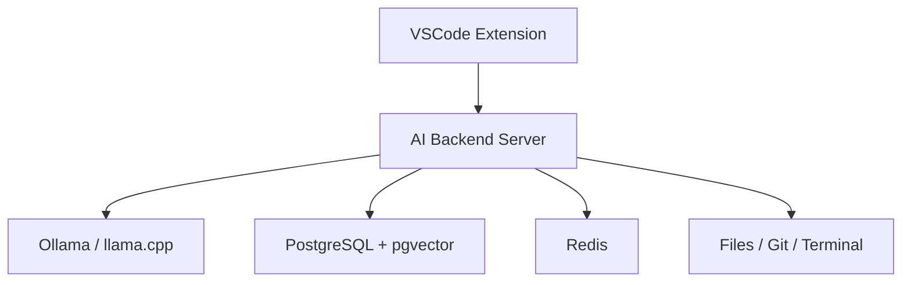

# Architecture

Arc is intentionally split into three independently evolvable components.

## VSCode Extension

The extension is a thin product adapter. It owns VSCode-specific UX and permissions:

- Chat panel and webview UI.
- Inline completion provider.
- Code actions.
- Diff preview and approval UI.
- Workspace identity and editor state.

The extension must not own LLM orchestration, memory, embedding, or tool execution policy.

## AI Backend Server

The NestJS backend is the durable product core. It owns:

- LLM provider orchestration.
- Prompt and context assembly.
- Tool calling.
- Repository indexing.
- Semantic search.
- Memory.
- Git and terminal adapters.
- Permission enforcement.

Milestone 1 exposes a `/health` endpoint and a Socket.IO gateway so clients can verify the
backend is reachable before chat features are added.

## Inference Provider Boundary

Milestone 2.1 introduces an `InferenceModule` with a provider-neutral `ChatModelPort`. The
application layer exchanges messages, text deltas, completion metadata, readiness states, and typed
errors only. Ollama's HTTP endpoints and newline-delimited JSON stream format are contained inside
the Ollama adapter.

This keeps the backend's future chat orchestration independent from a specific inference runtime.
Ollama is the first adapter; llama.cpp or another local provider can implement the same port without
changing the caller. The backend liveness endpoint remains separate from Ollama readiness at
`/providers/ollama/status`, so clients can distinguish a stopped Arc server from an unavailable or
misconfigured model.

## Streaming Chat Protocol

Milestone 2.2 adds a dedicated Socket.IO `/chat` namespace. Clients submit `chat:send` and
`chat:cancel` commands, while the backend emits `chat:accepted`, `chat:delta`,
`chat:completed`, `chat:cancelled`, and `chat:error` events. Every event is correlated by request
and session identifier and validated with shared Zod contracts.

The `ChatGateway` owns Socket.IO correlation and event emission. `SendChatMessageService` invokes
the provider port, while `DurableChatService` owns the durable request lifecycle. The active
generation registry holds only cancellable in-memory work and permits one generation per durable
session; it is not a conversation store.

## Webview Boundary

Milestone 2.3 gives the Arc activity-bar view a React and Tailwind UI that is bundled by Vite into
local extension assets. The webview has no network permission: it exchanges validated messages with
the extension host, which owns HTTP calls to the local backend. The initial bridge reports backend
and Ollama readiness only. It uses a nonce-based content security policy and allows scripts and
styles exclusively from the extension's generated webview assets.

## Ephemeral Chat State

Milestone 2.4.1 extends the webview bridge with validated chat lifecycle messages. The extension
host owns a single in-memory session, including request IDs, pending assistant placeholders, and
terminal generation states. A webview receives a hydration snapshot whenever it becomes ready, so
closing or reloading the view does not discard the Extension Host's temporary conversation.

This state is deliberately local and non-durable. The webview cannot open a transport connection or
choose correlation IDs; Socket.IO transport is added in Milestone 2.4.2, and persistent sessions
are deferred to Milestone 2.5.

## Extension Chat Transport

Milestone 2.4.2 introduces a provider-neutral `ChatTransportPort` in the extension host and a
Socket.IO implementation for the backend `/chat` namespace. The transport validates every backend
event against the shared contracts before the session controller can use it. The session controller
sends only the current user prompt and correlation identifiers; the backend owns retained context.
It forwards normalized lifecycle updates to the webview.

The Socket.IO client connects lazily when the Arc view becomes ready and uses bounded automatic
reconnection. A disconnect fails the active local generation with a retryable error; it never
silently repeats a user prompt.

## Streaming Chat Presentation

Milestone 2.4.3 presents the normalized session snapshot in the Arc webview. The React view renders
plain-text user and assistant messages, including pending, streaming, completed, cancelled, and
failed states. Its composer emits only validated bridge commands and is disabled while disconnected
or while a generation is active; Stop forwards a cancellation request to the extension host.

The conversation follows new streaming output until the user scrolls away, keeping a narrow sidebar
usable without fighting deliberate review of earlier messages. The webview remains a projection of
extension-host state, so its reload hydration behavior and transport ownership are unchanged.

## Integration and Resilience

Milestone 2.4.4 proves the prompt-to-token flow with a deterministic in-process model test spanning
the NestJS gateway and extension-host session controller. It covers ordered deltas, correlated
cancellation, and timeout normalization without requiring a local model during automated tests.

On backend loss, the extension marks the active assistant message as a retryable failure and leaves
the session available for an explicit future prompt. Socket.IO may reconnect, but the controller
never re-emits an earlier `chat:send` command, so a backend restart cannot create a duplicate
generation. The terminal smoke commands and manual test matrix document the matching Ollama and
Arc-view checks for a local machine.

## Durable Conversation Foundation

Milestone 2.5.1 introduces PostgreSQL as the planned authority for conversation history without
changing the current ephemeral chat flow. The `chat_sessions` table owns the durable session title,
timestamps, and monotonically allocated message order. `chat_messages` stores the user and assistant
records for a request, including cancelled and failed terminal states with structured errors.

Migrations are ordered SQL files applied by an explicit CLI command. The backend does not mutate the
schema during startup. The shared conversation contracts describe the future REST snapshots and
retain the message identifiers and request correlation needed when the gateway becomes durable in
Milestone 2.5.3.

## Conversation Repository

Milestone 2.5.2 adds a repository port behind Nest services for session lifecycle and assistant
generation state. The backend uses a small Sequelize database registry with factory-defined
`chatSessions` and `chatMessages` models, followed by their association in one central model index.
This deliberately mirrors the application's established Sequelize style without introducing a
second Nest-specific model abstraction. Future REST controllers and the realtime gateway consume the
services rather than querying tables directly.

Creating a turn locks its session row, first checks the `(session_id, request_id)` pair, then
allocates adjacent durable message ordinals in the same transaction. A repeated request ID returns
the original user and assistant records instead of creating a second turn. Assistant output moves
from `pending` to `streaming` and one terminal state through a single update path. On recovery, any
pending or streaming assistant messages become retryable `generation_failed` records.

Schema changes stay in the explicit migration runner; the backend never uses `sequelize.sync()`. On
startup it checks the PostgreSQL connection and logs a non-fatal availability warning, while the
migration command fails clearly if the database cannot be updated.

Milestone 2.5.2 kept this layer independent from the gateway so its database behavior could be
tested in isolation. Milestone 2.5.3 now composes it into the durable transport below.

## Durable Chat Transport

Milestone 2.5.3 makes PostgreSQL the authority for a running chat request. `POST /conversations`
creates a session, `GET /conversations` lists sessions, and `GET`, `PATCH`, and `DELETE`
`/conversations/:sessionId` provide snapshot, rename, and deletion operations for future clients.
The gateway accepts only `{ sessionId, requestId, content }`; it does not accept client-supplied
conversation history.

Before accepting a request, `DurableChatService` ensures the UUID session exists, persists the
completed user message and a pending assistant message, and loads the latest completed turns as
model context. Each emitted delta is stored as `streaming` first, then the assistant record becomes
`completed`, `cancelled`, or `failed` before the corresponding terminal event is emitted. Duplicate
request IDs replay the stored outcome instead of calling the model again.

At backend startup, unfinished assistant records are marked as retryable failures. The existing
extension's UUID session is temporarily registered lazily so the streaming experience remains
usable; Milestone 2.5.4 will replace that bridge with explicit REST-backed session creation and
history hydration.

## Local Infrastructure

Infrastructure is added only when a milestone needs it. PostgreSQL, pgvector, Redis, Ollama, and
embedding workers belong here, not inside the VSCode extension.

## Boundary Rule

The backend should be usable by future clients such as a CLI, web dashboard, JetBrains plugin, or
automation runner. VSCode is the first client, not the platform boundary.
