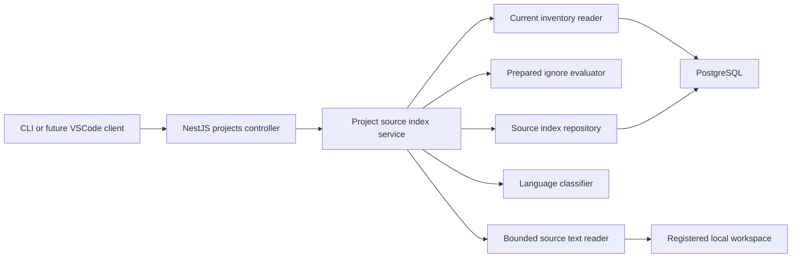
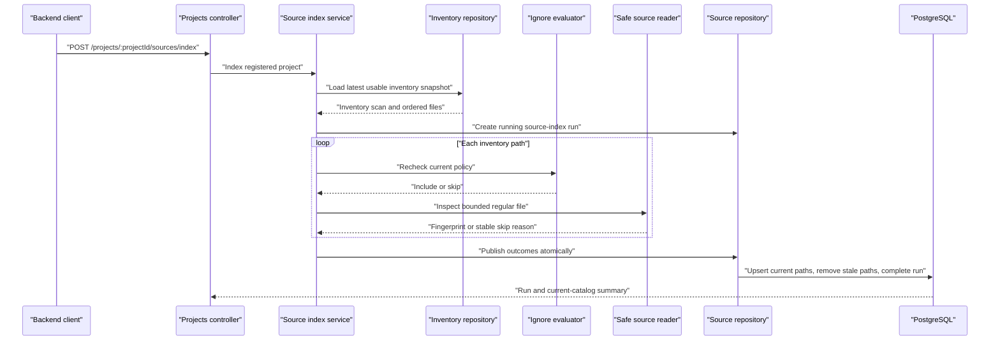

# Milestone 4.1 Architecture: Content Safety and Fingerprints

Status: Implemented and verified.

## Goal

Build the first content-aware backend boundary for Arc. An explicit source-index request will inspect
the current repository inventory, safely read bounded text files, calculate deterministic SHA-256
fingerprints, classify their languages, and publish an atomic source catalog.

Milestone 4.1 prepares reliable inputs for symbol parsing, project graphs, embeddings, and context
retrieval without implementing any of those features.

## Decisions

- The backend remains the only process allowed to read repository source for Arc intelligence.
- Source indexing is explicit and is never triggered by registration, metadata scanning, startup,
  or chat.
- Milestone 3 `project_files` remains the authoritative path inventory.
- Source fingerprints live in a separate catalog so a metadata rescan can make the catalog stale
  without deleting the last usable source result.
- Source bytes may exist transiently in backend memory but are never persisted, logged, returned by
  the API, sent to VSCode, or sent to Ollama.
- Only valid UTF-8 text is fingerprinted in this milestone.
- File language is classified from normalized path and basename rules. Unknown valid text is
  classified as `plaintext`.
- SHA-256 is calculated over the exact file bytes.
- A successful publication atomically replaces the current source catalog. A failed or interrupted
  run preserves the previous catalog.
- Tree-sitter, pgvector, Redis, workers, filesystem watching, and source chunks are deferred.

## Scope

Included:

- Source-index lifecycle and shared contracts.
- A safe, bounded Node.js source reader.
- Re-evaluation of ignore policy immediately before every content read.
- UTF-8 validation, NUL-byte rejection, and regular-file checks.
- Exact-byte SHA-256 fingerprints and path-based language classification.
- Durable run summaries and per-path source outcomes in PostgreSQL.
- Atomic publication, retry behavior, staleness reporting, and restart recovery.
- Synchronous REST endpoints and a local PostgreSQL acceptance command.

Not included:

- Persisted source text.
- Syntax trees, symbols, imports, routes, or dependency graphs.
- Embeddings, chunks, semantic search, or chat context.
- VSCode source-index commands or progress UI.
- Automatic indexing, filesystem watching, background workers, or cancellation.
- Non-UTF-8 decoding.

## Component Boundary

The source-index service orchestrates the use case. Filesystem safety belongs to the source-reader
adapter, persistence and transactions belong to the Sequelize repository, and request validation
belongs to shared contracts and the NestJS controller.

## Trust Boundary

Repository contents are untrusted input, even though Arc runs locally. A path may change after the
metadata scan, a regular file may become a symlink, and a file may grow while it is being read.

For each inventory entry, Arc must:

1. Normalize the stored project-relative path again.
2. Re-evaluate built-in, Git, and `.arcignore` rules.
3. Resolve the candidate and verify it remains below the canonical registered root.
4. Refuse symbolic links and non-regular files.
5. Open with `O_NOFOLLOW` where the platform supports it.
6. Compare the opened descriptor with the pre-open file identity and expected inventory metadata.
7. Enforce the per-file limit before and during the read.
8. Read at most `maxFileBytes`.
9. Reject NUL bytes and invalid UTF-8.
10. Recheck descriptor metadata after reading to detect concurrent mutation.
11. Calculate SHA-256 over the original bytes and release the buffer after the file result is built.

No design can make a mutable local filesystem a perfect snapshot without platform-specific
facilities. The identity and metadata checks make concurrent changes fail closed: Arc records a
stable skipped outcome and requires a metadata rescan instead of accepting uncertain content.

## Index Flow

The service processes paths in deterministic lexical order. It reads one file at a time in 4.1 so
memory and disk pressure remain predictable on the target Intel Mac. Only compact outcomes are kept
until publication; file buffers are not accumulated.

## Inventory Consistency

Source indexing uses the latest `completed` or `limited` metadata scan, not merely the latest scan
row. This permits retry after a failed metadata scan while preserving the last usable inventory.
An empty successful inventory is valid.

Every source-index run stores the inventory scan UUID it consumed. The latest usable source catalog
is stale when that UUID differs from the current usable inventory scan UUID. A new metadata scan
does not silently read files or delete fingerprints; it only makes the freshness mismatch visible.

Files whose size or modification time no longer matches the selected inventory are recorded as
`inventory_stale` and are not fingerprinted. The user must run the existing metadata scan before
retrying source indexing.

## Persistence Model

### `project_source_index_runs`

- `id`: UUID primary key.
- `project_id`: owning project UUID.
- `inventory_scan_id`: metadata scan consumed by this run.
- `status`: `running`, `completed`, `limited`, or `failed`.
- `ready_file_count`: fingerprinted UTF-8 files.
- `skipped_file_count`: files rejected or no longer eligible.
- `inspected_bytes`: all bytes read, including content later rejected as binary or invalid UTF-8.
- `ready_bytes`: bytes belonging to successfully fingerprinted files.
- `limit_reasons`: JSON array with stable values.
- `error_code`: nullable stable run-level error code.
- `started_at` and `completed_at`.

PostgreSQL enforces one `running` source-index run per project with a partial unique index.

### `project_source_files`

- `id`: stable UUID primary key.
- `project_id`: owning project UUID.
- `source_index_run_id`: latest successful or limited run that published this row.
- `inventory_scan_id`: metadata scan used for the outcome.
- `relative_path`: normalized project-relative path.
- `status`: `ready` or `skipped`.
- `skip_reason`: nullable stable reason.
- `content_hash`: nullable lowercase SHA-256 hex.
- `language`: nullable normalized language ID.
- `size_bytes` and `modified_at`: observed descriptor values, or inventory metadata when the file
  cannot be safely opened.
- `indexed_at`.

There is one current row per `(project_id, relative_path)`. Ready rows require a content hash,
language, and no skip reason. Skipped rows require a skip reason and must not contain a hash.
Source text is deliberately absent.

On publication, one Sequelize transaction:

1. Locks and verifies the running source-index row.
2. Bulk-upserts every current inventory outcome while preserving stable source-file UUIDs.
3. Deletes source rows whose paths are absent from the published catalog.
4. Marks the run `completed` or `limited`.

If any publication operation fails, the transaction rolls back and the previous source catalog
remains usable. Historical run summaries remain durable; source-file rows represent only the
current published catalog.

## Contracts and API

Shared Zod contracts define:

- Source-index status, limit reason, and error code.
- Source-file status and skip reason.
- Source-index summary.
- Current catalog summary, including `inventoryScanId` and `stale`.
- Latest response with both `latestRun` and `currentCatalog`.

Endpoints:

- `POST /projects/:projectId/sources/index`
  starts a synchronous explicit run and returns its terminal summary.
- `GET /projects/:projectId/sources/index`
  returns the latest run plus the latest usable catalog summary.

Stable HTTP behavior:

- `400` for an invalid project UUID.
- `404` for an unknown project.
- `409` when no usable inventory exists or another source index is running.
- `503` when a run fails because the filesystem or persistence boundary is unavailable.

The API does not return source text or a repository-wide file listing in 4.1.

## Outcomes and Limits

Stable per-file skip reasons:

- `ignored_since_scan`
- `inventory_stale`
- `file_missing`
- `file_too_large`
- `not_regular_file`
- `symbolic_link`
- `unsafe_path`
- `binary_content`
- `invalid_utf8`
- `file_changed_during_read`
- `file_read_error`
- `run_limit`

Expected file-level skips do not fail the whole run. A `limited` run means a run-level budget
prevented Arc from inspecting every inventory entry. Fatal root, database, or publication failures
produce a failed run and preserve the previous catalog.

Initial configuration:

- `ARC_PROJECT_SOURCE_MAX_FILE_BYTES=1048576` (1 MiB).
- `ARC_PROJECT_SOURCE_MAX_TOTAL_BYTES=268435456` (256 MiB).
- `ARC_PROJECT_SOURCE_BATCH_SIZE=500`.

The total-byte budget counts every inspected byte, including content later rejected as binary or
invalid UTF-8. Once the next eligible file would exceed the remaining budget, that file and all
remaining unread paths receive `run_limit` without being opened.

## Recovery

On backend bootstrap, every abandoned `running` source-index run becomes `failed` with
`index_interrupted`. Recovery never modifies `project_source_files`, so the last published catalog
survives a backend crash.

Source indexing is idempotent with respect to content: repeated runs may have different run UUIDs
and timestamps, but unchanged ready files retain their source-file UUIDs and SHA-256 values.

## Class and Module Design

Application:

- `ProjectSourceIndexService`: orchestration and run policy.
- `ProjectSourceIndexRepository`: run lifecycle and atomic catalog publication port.
- `SourceTextReader`: safe transient content-read port.
- `SourceLanguageClassifier`: deterministic path-to-language class.
- Existing `ProjectInventoryRepository`: gains a current usable snapshot query.
- Existing `ProjectIgnorePolicyService`: supplies one prepared evaluator per run.

Infrastructure:

- `NodeSourceTextReader`: Node filesystem implementation.
- `SequelizeProjectSourceIndexRepository`: PostgreSQL implementation.
- Class-based Sequelize models for source runs and source files.

Presentation:

- Existing `ProjectsController`: validated source-index endpoints and error mapping.

The use case remains inside the existing projects bounded context. A separate NestJS module would
add ceremony without creating an independent domain boundary at this stage.

## Implementation Files

Create:

- `packages/contracts/src/api/project-source-index.contract.ts`
- `packages/contracts/src/api/project-source-index.contract.test.ts`
- `apps/ai-server/migrations/0004_project_source_index.sql`
- `apps/ai-server/src/database/models/project-source-index-run.model.ts`
- `apps/ai-server/src/database/models/project-source-file.model.ts`
- `apps/ai-server/src/modules/projects/domain/project-source-index.types.ts`
- `apps/ai-server/src/modules/projects/application/project-source-index.repository.ts`
- `apps/ai-server/src/modules/projects/application/source-text.reader.ts`
- `apps/ai-server/src/modules/projects/application/source-language.classifier.ts`
- `apps/ai-server/src/modules/projects/application/source-language.classifier.test.ts`
- `apps/ai-server/src/modules/projects/application/project-source-index.service.ts`
- `apps/ai-server/src/modules/projects/application/project-source-index.service.test.ts`
- `apps/ai-server/src/modules/projects/infrastructure/node-source-text.reader.ts`
- `apps/ai-server/src/modules/projects/infrastructure/node-source-text.reader.test.ts`
- `apps/ai-server/src/modules/projects/infrastructure/sequelize-project-source-index.repository.ts`
- `apps/ai-server/src/modules/projects/infrastructure/sequelize-project-source-index.repository.test.ts`
- `apps/ai-server/src/cli/source-index-verify.ts`

Modify:

- `packages/contracts/src/index.ts`
- `apps/ai-server/src/config/env.ts`
- `apps/ai-server/src/config/env.test.ts`
- `apps/ai-server/src/database/database.types.ts`
- `apps/ai-server/src/database/models/index.ts`
- `apps/ai-server/src/modules/projects/application/project-inventory.repository.ts`
- `apps/ai-server/src/modules/projects/domain/project.errors.ts`
- `apps/ai-server/src/modules/projects/projects.constants.ts`
- `apps/ai-server/src/modules/projects/projects.module.ts`
- `apps/ai-server/src/modules/projects/presentation/projects.controller.ts`
- `apps/ai-server/src/modules/projects/presentation/projects.controller.test.ts`
- `apps/ai-server/package.json`
- `package.json`
- `.env.example`
- `README.md`
- `docs/architecture.md`
- `docs/milestones.md`

No VSCode extension files change in Milestone 4.1.

## Dependency Changes

No new runtime dependency is required.

- Node `crypto` provides SHA-256.
- Node `fs/promises` and file descriptors provide bounded reads and metadata checks.
- The platform `TextDecoder` with `{ fatal: true }` validates UTF-8.
- Existing Sequelize, PostgreSQL, Zod, and ignore-policy dependencies remain sufficient.

Tree-sitter is intentionally deferred to Milestone 4.2 so native or WASM parser packaging can be
evaluated independently.

## Alternatives Considered

Add fingerprint columns directly to `project_files`:

- Rejected because Milestone 3 atomically replaces those rows during every metadata scan.
- A separate catalog preserves the previous source result and makes freshness an explicit UUID
  comparison.

Persist source text with the fingerprint:

- Rejected in 4.1 because it duplicates private repository content before any parser or retrieval
  feature needs it.
- Future chunk storage requires its own retention, invalidation, and privacy decision.

Parse, fingerprint, and embed in one pass:

- Rejected because filesystem safety, parser packaging, and vector retrieval would fail as one large
  unit.
- Separate gates make hashes the stable invalidation boundary for symbols and embeddings.

Start with an asynchronous worker:

- Deferred until source indexing is functionally proven. The synchronous API matches the existing
  inventory flow and avoids Redis or job-state complexity in this milestone.

## Implementation Gates

1. Contracts, configuration, migration, and models compile with database tests.
2. The source reader and language classifier pass filesystem safety tests without PostgreSQL.
3. The service and Sequelize repository pass lifecycle, atomicity, concurrency, and recovery tests.
4. Controller tests and `pnpm source:index:verify` pass against local PostgreSQL.

Every gate must leave the monorepo build, test, lint, and format checks passing.

## Acceptance Gate

- Indexing requires an explicitly registered project and a usable metadata inventory.
- Ignore changes made after the metadata scan are honored before content is opened.
- Escaping paths, symlinks, non-regular files, binary data, invalid UTF-8, oversized files, and
  concurrent mutations are never fingerprinted.
- Ready files store exact-byte SHA-256, language, size, modification time, and no source text.
- Repeating an unchanged index preserves source-file UUIDs and hashes.
- A metadata rescan makes the prior source catalog report `stale` until reindexed.
- Successful and limited runs atomically replace the source catalog.
- Failed and restart-interrupted runs preserve the previous catalog.
- Concurrent runs for one project return a conflict.
- The local verifier proves initial indexing, unchanged reindexing, changed-file hashing, stale
  detection, ignore re-evaluation, binary and symlink rejection, atomic failure preservation,
  restart recovery, and cleanup.
- Full build, test, lint, format, migration, and local PostgreSQL verification pass.

## Future Milestones

- 4.2 consumes ready source files with Tree-sitter and persists symbols.
- 4.3 builds import and dependency edges.
- 4.4 adds framework-specific analyzers for NestJS, Express, Next.js, React, and Sequelize.
- 4.5 adds the VSCode indexing workflow and final Source Intelligence acceptance.
- Milestone 5 introduces chunks, pgvector embeddings, semantic search, and hybrid retrieval.
