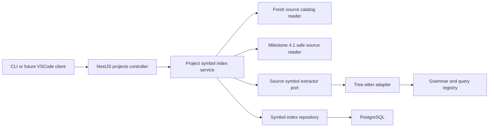

# Milestone 4.2 Architecture: Symbol Extraction

Status: Architecture approved. Milestones 4.2.1 and 4.2.2 are complete; 4.2.3-4.2.4 remain planned.

## Goal

Turn the fresh, fingerprinted source catalog from Milestone 4.1 into a durable language-neutral
symbol catalog. Arc will safely re-read eligible source files, parse JavaScript, TypeScript, and TSX
with Tree-sitter, extract named declarations, and atomically publish structured symbol locations.

Milestone 4.2 establishes syntax and symbol identity only. Imports, dependency edges, framework
semantics, embeddings, and chat context remain later milestones.

## Decisions

- Parsing remains a backend responsibility; neither VSCode nor the webview loads parser runtimes.
- Use the official native Node Tree-sitter binding behind an Arc-owned adapter.
- Start with `javascript`, `javascriptreact`, `typescript`, and `typescriptreact` language IDs.
- Use the JavaScript grammar for JavaScript and JSX, the TypeScript grammar for TypeScript, and the
  distinct TSX grammar for TSX.
- Pin one tested compatible runtime and grammar version set during the 4.2.1 compatibility gate.
- Use declarative Tree-sitter queries isolated by language rather than spreading syntax-node names
  through the application service.
- Parse files sequentially and yield between files. Milestone 4.1 already limits every source file
  to 1 MiB by default.
- Never persist syntax trees, source bodies, signatures, comments, string literals, or source
  slices.
- Persist only symbol names, qualified names, kinds, export flags, stable identity keys, source
  ranges, parser identity, and syntax-error state.
- Reuse prior symbol results when both the source SHA-256 and parser identity are unchanged.
- Publish the complete symbol catalog in one Sequelize transaction.
- A failed or interrupted symbol-index run preserves the previous usable catalog.
- Do not automatically run symbol extraction after source indexing.

## Why Native Node Tree-sitter

Arc parses inside the local NestJS backend, so browser portability is not needed at this boundary.
The official Node binding directly accepts published grammar packages and exposes parsing,
incremental tree, and query APIs. A WASM design would add grammar compilation, runtime asset
copying, and path resolution in both `tsx` development and compiled `dist` execution.

Tradeoff:

- Native packages can expose Node ABI, compiler, or platform installation problems.
- Milestone 4.2.1 therefore proves installation, ESM/CJS interop, parser creation, query execution,
  Unicode ranges, malformed input, and production compilation on the actual Intel Mac before any
  migration is added.
- If that gate fails on the supported local environment, implementation stops and the runtime
  decision is reopened. Arc will not carry native and WASM parser paths simultaneously.

Tree-sitter describes itself as an incremental parsing library designed to remain useful in the
presence of syntax errors. The official Node documentation demonstrates loading language grammar
packages and inspecting node ranges. The official TypeScript grammar exposes separate TypeScript
and TSX dialects:

- [Node Tree-sitter documentation](https://tree-sitter.github.io/node-tree-sitter/index.html)
- [Tree-sitter project](https://github.com/tree-sitter/tree-sitter)
- [Tree-sitter TypeScript grammar](https://github.com/tree-sitter/tree-sitter-typescript)

### Proven Native Stack

Milestone 4.2.1 selected and pinned the mutually compatible set:

- `tree-sitter@0.21.1`
- `tree-sitter-javascript@0.23.1`
- `tree-sitter-typescript@0.23.2`

The JavaScript grammar's current latest release targets Tree-sitter 0.25, while the TypeScript
grammar declares Tree-sitter 0.21 compatibility and depends on JavaScript grammar 0.23.1. Arc pins
the coherent 0.21 runtime line instead of mixing those peer contracts. pnpm native-build permission
is limited to these three packages.

The tested Node binding reports indices and columns from string input as UTF-16 code units. Arc's
infrastructure probe converts them to zero-based, end-exclusive UTF-8 byte offsets and byte columns.
The compatibility suite locks both the observed native indices and the normalized Arc range with a
multibyte fixture.

## Scope

Included:

- Native parser compatibility and lifecycle boundary.
- JavaScript, JSX, TypeScript, and TSX grammar registry.
- Language-specific symbol query packs.
- Language-neutral extracted symbol contract.
- Durable symbol-index runs, per-file parse state, and current symbols.
- Source-hash and parser-version invalidation.
- Atomic changed-file replacement and unchanged-file reuse.
- Syntax-error-tolerant extraction.
- Explicit synchronous REST index and status endpoints.
- Restart recovery and local PostgreSQL acceptance command.

Not included:

- Import, export-target, dependency, inheritance, reference, or call edges.
- NestJS decorators, Express routes, React component semantics, or Sequelize associations.
- Persisted syntax trees or arbitrary source snippets.
- Symbol search or a public symbol-list endpoint.
- Embeddings, chunks, semantic retrieval, or prompt context.
- Filesystem watching, automatic parsing, background jobs, or cancellation.
- VSCode symbol-index controls or progress UI.
- Languages beyond JavaScript, JSX, TypeScript, and TSX.

## Component Boundary



The application service sees only Arc domain results. Tree-sitter parser, tree, node, query, and
capture types do not cross the infrastructure adapter boundary.

## Freshness Boundary

Symbol extraction requires a current source catalog from Milestone 4.1:

1. The source catalog must exist.
2. Its `inventoryScanId` must match the latest usable metadata inventory.
3. The symbol run stores the source-index run UUID it consumes.
4. Every file that requires parsing is re-read through `SourceTextReader`.
5. Its newly calculated SHA-256 must equal the catalog hash before parsing starts.

An unchanged file with a matching successful parser identity reuses its durable parse state and
symbols without another read. Freshness is inherited from the current 4.1 source catalog.

If the catalog is stale before the run starts, the API returns a conflict and creates no symbol
run. If an individual file changes after the initial check, that file receives a stable
`source_changed` state and its old symbols are removed during publication.

A later successful source-index run makes the symbol catalog observably stale until explicit symbol
indexing runs again.

## Parser Runtime

`TreeSitterSymbolExtractor` owns:

- Native module interop.
- One lazily initialized parser and compiled query per supported dialect.
- Grammar and query compatibility checks.
- Parser reset after each extraction; native tree objects are released by the binding when their
  JavaScript references leave scope, while compiled queries remain cached with the parser.
- Query capture normalization.
- Syntax-error detection.
- Deterministic symbol ordering.
- Parser identity generation.

The parser identity is a stable string derived from:

- Tree-sitter runtime version.
- Grammar package and dialect version.
- Arc query-schema version.

An unchanged source hash is reusable only when this full parser identity also matches.

The service parses one file at a time. It yields to the Node event loop after a configurable number
of files, initially 25. Worker threads are deferred until profiling demonstrates that bounded native
parses materially interfere with local chat; adding workers before parser compatibility is proven
would complicate `tsx` and compiled worker loading.

## Query Packs

Query packs are TypeScript string modules so the existing `tsc` build does not need a static `.scm`
asset-copy pipeline. They remain isolated under the Tree-sitter infrastructure directory and are
compiled into `dist` with the adapter.

Initial query packs:

- JavaScript/JSX declarations.
- TypeScript declarations and type forms.
- TSX declarations using the TSX grammar.

Query captures identify definition kind, definition node, and name node. The adapter converts
captures to a common result and derives lexical parents by source-range containment.

Included symbols:

- Modules and namespaces.
- Classes and interfaces.
- Type aliases and enums.
- Named functions, including named arrow/function expressions assigned at declaration level.
- Constructors and named methods.
- Class and interface properties.
- Module-level variables and constants.
- Nested named declarations with a lexical symbol parent.

Excluded:

- Anonymous callbacks and anonymous default exports.
- Function-local variables that are not named functions.
- Imports and re-export targets.
- JSX elements.
- Object literal properties outside class/interface declarations.

Framework-specific interpretation is deferred. A NestJS controller is a class in 4.2; it becomes a
controller in 4.4.

## Symbol Identity

Each extracted symbol receives a deterministic `identityKey`, calculated as SHA-256 over:

```txt
language + NUL + parentIdentityKey + NUL + kind + NUL + name + NUL + siblingOccurrence
```

`siblingOccurrence` is the zero-based occurrence among symbols with the same parent, kind, and name
in source order. Start offsets are deliberately excluded so inserting unrelated lines does not
change symbol identity.

The database uniqueness boundary is `(source_file_id, identity_key)`. Sequelize upserts preserve
the server-generated symbol UUID when that logical identity remains present. Overloads and duplicate
declarations remain distinct through `siblingOccurrence`.

`parentIdentityKey` is persisted rather than a self-referencing UUID. This keeps bulk publication
simple and deterministic while preserving the lexical hierarchy. Milestone 4.3 can resolve parent
keys through the same source-file scope.

## Language-Neutral Symbol

Stable symbol kinds:

- `module`
- `namespace`
- `class`
- `interface`
- `type_alias`
- `enum`
- `function`
- `constructor`
- `method`
- `property`
- `variable`
- `constant`

Each symbol stores:

- Stable UUID and identity key.
- Project, source-file, and symbol-index run UUIDs.
- Parent identity key or `null`.
- Kind, name, and qualified name.
- Exported flag.
- Zero-based start/end UTF-8 byte offsets.
- Zero-based start/end lines and byte columns.

Range semantics must be proven with ASCII and multibyte fixtures in 4.2.1. End positions are
exclusive.

Symbol names are source-derived data. This milestone intentionally expands local persistence beyond
4.1 fingerprints, but only for declaration identifiers. Names and qualified names are limited to
512 and 2,048 UTF-8 bytes respectively. Over-limit captures are omitted and reported as a stable
limit reason; they are never silently truncated.

## Persistence Model

### `project_symbol_index_runs`

- `id`: UUID primary key.
- `project_id`: owning project UUID.
- `source_index_run_id`: source catalog consumed by this run.
- `status`: `running`, `completed`, `limited`, or `failed`.
- `parsed_file_count`, `reused_file_count`, `unsupported_file_count`, and `failed_file_count`.
- `symbol_count` and `omitted_symbol_count`.
- `limit_reasons`: stable text array.
- `error_code`: nullable stable run-level error.
- `started_at` and `completed_at`.

A partial unique index permits one `running` symbol index per project.

### `project_symbol_files`

- `id`: UUID primary key.
- `project_id` and `source_file_id`.
- `symbol_index_run_id`.
- `source_content_hash`.
- `parser_identity`.
- `language`.
- `status`: `parsed`, `parsed_with_errors`, `unsupported`, `failed`, or `limited`.
- `has_syntax_errors`.
- `symbol_count` and `omitted_symbol_count`.
- `error_code`: nullable file-level error.
- `parsed_at`.

There is one current row per source-file UUID, including files with zero symbols or unsupported
languages. This row is the incremental reuse boundary.

### `project_symbols`

- `id`: stable UUID primary key.
- `project_id`, `source_file_id`, and `symbol_index_run_id`.
- `identity_key` and nullable `parent_identity_key`.
- `kind`, `name`, and `qualified_name`.
- `exported`.
- Start/end byte, line, and column fields.

There is one current symbol per `(source_file_id, identity_key)`. No source body, signature,
documentation, literal, syntax tree, or generic JSON metadata is stored.

## Atomic Publication

The service builds a publication plan outside the database transaction:

- Reusable source-file IDs.
- Changed-file parse states and symbol sets.
- Unsupported and failed-file states.
- Ready source-file IDs absent from the new result.

One Sequelize transaction then:

1. Locks the running symbol-index row.
2. Reassigns reusable file states and their symbols to the new run.
3. Upserts changed-file states.
4. Upserts changed-file symbols by `(source_file_id, identity_key)`.
5. Deletes symbols no longer present for changed files.
6. Deletes states and symbols for files no longer ready in the source catalog.
7. Completes the run as `completed` or `limited`.

Any failure rolls back the full publication. A failed run changes only its run row and leaves the
previous symbol catalog untouched.

## Incremental Rules

A file is reusable when:

- It remains `ready` in the current source catalog.
- Its SHA-256 matches the current symbol-file state.
- Its language is unchanged.
- Its parser identity is unchanged.
- Its prior state is `parsed`, `parsed_with_errors`, or `unsupported`.

Files in `failed` or `limited` states are retried. A changed source hash, grammar version, runtime
version, or Arc query-schema version forces reparse.

Incremental Tree-sitter edit reuse is not used between durable runs because Arc does not persist
syntax trees or edit deltas. Milestone 4.2 reuses complete file results by hash instead.

## Failure Model

Precondition errors:

- `source_catalog_required`
- `source_catalog_stale`

Run-level errors:

- `parser_unavailable`
- `symbol_persistence_error`
- `index_interrupted`
- `unknown_error`

File-level errors:

- `source_changed`
- `source_read_error`
- `unsupported_language`
- `parse_error`
- `symbol_limit`
- `symbol_text_limit`

Unsupported languages and individual parse failures do not fail the complete run. They receive
durable file states, stale prior symbols are removed, and counters remain visible. Parser registry
initialization or transaction failure is run-level and preserves the previous catalog.

Tree-sitter trees containing `ERROR` or missing nodes are not treated as parser failures. Arc
persists valid captured symbols with `parsed_with_errors` and `hasSyntaxErrors=true`.

## Limits

Initial configuration:

- `ARC_PROJECT_SYMBOL_MAX_SYMBOLS_PER_FILE=5000`
- `ARC_PROJECT_SYMBOL_MAX_TOTAL_SYMBOLS=100000`
- `ARC_PROJECT_SYMBOL_MAX_NAME_BYTES=512`
- `ARC_PROJECT_SYMBOL_MAX_QUALIFIED_NAME_BYTES=2048`
- `ARC_PROJECT_SYMBOL_YIELD_EVERY_FILES=25`
- `ARC_PROJECT_SYMBOL_BATCH_SIZE=500`

Per-file limits produce a `limited` file state. Reaching the total-symbol limit stops parsing
remaining files, records limited states, and completes the run as `limited`.

## API

Endpoints:

- `POST /projects/:projectId/symbols/index`
  starts one explicit synchronous symbol-index run.
- `GET /projects/:projectId/symbols/index`
  returns the latest run and current symbol-catalog summary.

Stable HTTP behavior:

- `400` for an invalid project UUID.
- `404` for an unknown project.
- `409` for a missing/stale source catalog or an already-running symbol index.
- `503` for parser initialization or persistence failure.

The API returns counters and freshness only. It does not expose symbol names or source content in
4.2.

## Recovery

On backend bootstrap, abandoned `running` symbol-index rows become `failed/index_interrupted`.
Recovery never modifies `project_symbol_files` or `project_symbols`, preserving the last published
catalog.

## Class and Module Design

Application:

- `ProjectSymbolIndexService`: orchestration, freshness, limits, reuse, and failure policy.
- `ProjectSymbolIndexRepository`: run lifecycle, current state reads, and atomic publication port.
- `SourceSymbolExtractor`: parser-neutral extraction port.
- Existing `ProjectSourceIndexRepository`: gains a current ready source-catalog query.
- Existing `SourceTextReader`: safely re-reads source and verifies hashes.

Infrastructure:

- `TreeSitterLanguageRegistry`: dialect, grammar, query, and parser identity registry.
- `TreeSitterSymbolExtractor`: native parser/query adapter.
- Per-language query modules.
- `SequelizeProjectSymbolIndexRepository`.
- Three class-based Sequelize models.

Presentation:

- Existing `ProjectsController`: symbol-index and status endpoints.

The feature remains in the projects bounded context. Tree-sitter types stay inside its
infrastructure directory.

## Planned File Changes

Create:

- `packages/contracts/src/api/project-symbol-index.contract.ts`
- `packages/contracts/src/api/project-symbol-index.contract.test.ts`
- `apps/ai-server/migrations/0005_project_symbols.sql`
- `apps/ai-server/src/database/models/project-symbol-index-run.model.ts`
- `apps/ai-server/src/database/models/project-symbol-file.model.ts`
- `apps/ai-server/src/database/models/project-symbol.model.ts`
- `apps/ai-server/src/modules/projects/domain/project-symbol-index.types.ts`
- `apps/ai-server/src/modules/projects/application/project-symbol-index.repository.ts`
- `apps/ai-server/src/modules/projects/application/source-symbol.extractor.ts`
- `apps/ai-server/src/modules/projects/application/project-symbol-index.service.ts`
- `apps/ai-server/src/modules/projects/application/project-symbol-index.service.test.ts`
- `apps/ai-server/src/modules/projects/infrastructure/tree-sitter/tree-sitter-language.registry.ts`
- `apps/ai-server/src/modules/projects/infrastructure/tree-sitter/tree-sitter-symbol.extractor.ts`
- `apps/ai-server/src/modules/projects/infrastructure/tree-sitter/tree-sitter-symbol.extractor.test.ts`
- `apps/ai-server/src/modules/projects/infrastructure/tree-sitter/queries/javascript-symbol.query.ts`
- `apps/ai-server/src/modules/projects/infrastructure/tree-sitter/queries/typescript-symbol.query.ts`
- `apps/ai-server/src/modules/projects/infrastructure/sequelize-project-symbol-index.repository.ts`
- `apps/ai-server/src/modules/projects/infrastructure/sequelize-project-symbol-index.repository.test.ts`
- `apps/ai-server/src/cli/symbol-index-verify.ts`

Modify:

- `packages/contracts/src/index.ts`
- `apps/ai-server/src/config/env.ts`
- `apps/ai-server/src/config/env.test.ts`
- `apps/ai-server/src/database/database.types.ts`
- `apps/ai-server/src/database/models/index.ts`
- `apps/ai-server/src/modules/projects/application/project-source-index.repository.ts`
- `apps/ai-server/src/modules/projects/domain/project.errors.ts`
- `apps/ai-server/src/modules/projects/projects.constants.ts`
- `apps/ai-server/src/modules/projects/projects.module.ts`
- `apps/ai-server/src/modules/projects/presentation/projects.controller.ts`
- `apps/ai-server/src/modules/projects/presentation/projects.controller.test.ts`
- `apps/ai-server/package.json`
- `package.json`
- `.env.example`
- `README.md`
- `docs/architecture.md`
- `docs/milestones.md`

No VSCode extension files change in Milestone 4.2.

## Dependency Changes

Planned backend-only runtime dependencies:

- `tree-sitter`
- `tree-sitter-javascript`
- `tree-sitter-typescript`

The 4.2.1 gate selects and pins mutually compatible versions in `pnpm-lock.yaml`; the architecture
does not guess those versions in advance. No Tree-sitter CLI, WASM compiler, parser download,
Redis, pgvector, or worker-pool dependency is added.

## Implementation Gates

### 4.2.1 Native Parser Compatibility

Status: Complete.

- Install and pin the native runtime and JS/TS grammar set.
- Prove JavaScript, JSX, TypeScript, and TSX parsing in tests and a terminal smoke command.
- Prove ESM/CJS imports, Unicode byte ranges, malformed syntax behavior, repeated tree cleanup,
  `tsx` development execution, and compiled backend execution on Intel macOS.
- No migration or symbol persistence.

Implemented:

- Backend-only class-based language registry and compatibility probe.
- Minimal query execution without introducing symbol query packs early.
- UTF-8 byte-range normalization at the native infrastructure boundary.
- Malformed-tree and 250-iteration lifecycle coverage.
- `pnpm tree-sitter:smoke` and `pnpm tree-sitter:smoke:compiled`.
- Verified on Node `v24.18.0`, Darwin x64.

### 4.2.2 Extraction Contracts and Query Packs

Status: Complete.

- Add language-neutral symbol types and extractor port.
- Implement query packs, parent hierarchy, kinds, export flags, limits, and deterministic identity
  keys.
- Golden fixtures cover representative JavaScript, TypeScript, TSX, malformed, Unicode, duplicate,
  and zero-symbol files.
- No PostgreSQL writes.

Implemented:

- Parser-neutral source-symbol language, kind, range, limit, input, symbol, and result types.
- `SourceSymbolExtractor` application port with no Tree-sitter types.
- JavaScript/JSX and TypeScript/TSX query packs compiled as TypeScript strings.
- Lazily cached parsers and queries with query-schema-versioned parser identities.
- Context filtering for declaration-level variables, named function bindings, class/interface
  members, anonymous declarations, object members, imports, and JSX.
- Lexical parent containment, qualified names, direct export flags, deterministic source ordering,
  duplicate sibling occurrences, and SHA-256 identity keys.
- Name, qualified-name, and per-file symbol limits without truncation.
- Golden coverage for all four dialects, malformed syntax, Unicode ranges, duplicate stability,
  exclusions, zero-symbol files, and limit behavior.

### 4.2.3 Durable Incremental Symbol Catalog

- Add migration, class-based Sequelize models, repository, service, API, and restart recovery.
- Reuse unchanged hashes and parser identities.
- Atomically replace changed-file symbols and preserve the previous catalog on failure.

### 4.2.4 Acceptance

- Add `pnpm symbol:index:verify`.
- Verify initial parse, unchanged reuse, changed-file replacement, deleted symbols, syntax errors,
  unsupported languages, source changes, limit behavior, atomic rollback, restart recovery, no
  source-body persistence, and cleanup against local PostgreSQL.
- Run the complete workspace gate.

Every gate must compile and pass independently before the next gate starts.

## Acceptance Gate

- Parser installation and production execution pass on the target Intel Mac.
- Only fresh, ready, hash-verified source files are parsed.
- JavaScript, JSX, TypeScript, and TSX fixtures produce deterministic language-neutral symbols.
- Symbol UUIDs survive unrelated line movement and unchanged reindexing.
- Duplicate declarations remain distinct and lexical parents remain stable.
- Syntax-error files retain valid captures with explicit error state.
- Unsupported, failed, and limited files cannot retain stale symbols.
- Unchanged source hashes and parser identities are reused without reading or parsing again.
- Source, grammar, or query-version changes invalidate only affected files.
- A source-index change makes the symbol catalog report stale.
- Successful publication is atomic; failed and interrupted runs preserve the previous catalog.
- PostgreSQL contains declaration identifiers and ranges but no source bodies, signatures, comments,
  literals, or syntax trees.
- Full build, test, lint, format, migration, parser smoke, and local PostgreSQL verification pass.

## Future Milestones

- 4.3 resolves imports, exports, module dependencies, inheritance, and reference edges.
- 4.4 interprets symbols and decorators as NestJS, Express, Next.js, React, and Sequelize concepts.
- 4.5 adds explicit VSCode indexing controls, progress, and final Source Intelligence acceptance.
- Milestone 5 chunks source, adds pgvector embeddings, and builds semantic and hybrid retrieval.
