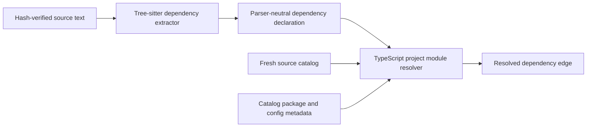
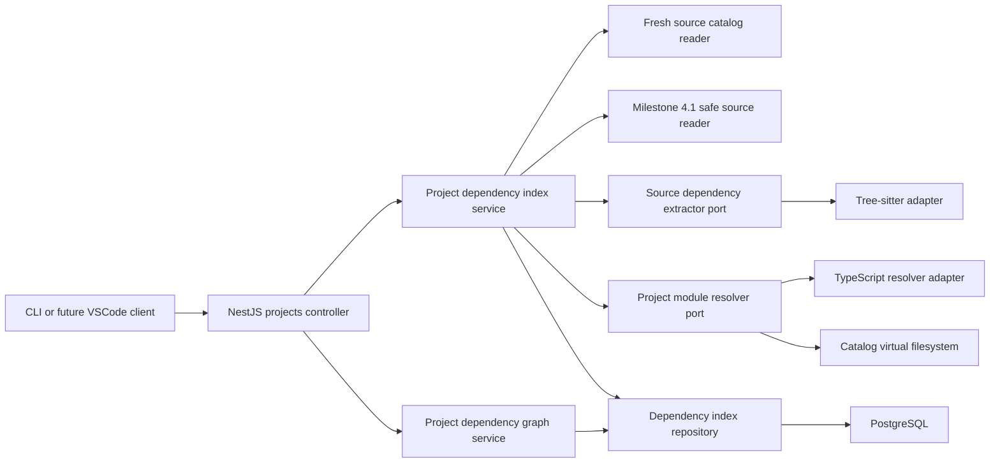

# Milestone 4.3 Architecture: Import and Dependency Graph

Status: Complete. Milestones 4.3.1 through 4.3.4 are implemented and verified.

## Goal

Turn the fresh Milestone 4.1 source catalog into a durable, freshness-aware graph of JavaScript and
TypeScript module relationships. Arc will extract dependency declarations with Tree-sitter,
resolve project-local targets with TypeScript-compatible rules, classify external and Node built-in
modules, and expose bounded graph traversal without persisting source bodies.

Milestone 4.3 establishes file and module relationships only. Framework semantics, call graphs,
symbol references, inheritance, embeddings, prompt context, and VSCode controls remain later
milestones.

## Decisions

- Dependency indexing remains a backend responsibility.
- Tree-sitter extracts dependency syntax; it does not resolve filesystem targets.
- A TypeScript compiler API adapter resolves project-local module semantics.
- Tree-sitter and TypeScript compiler types stay inside infrastructure adapters.
- Node built-ins are classified with `node:module` before project resolution.
- Initial extraction supports JavaScript, JSX, TypeScript, and TSX.
- Only static string-literal module specifiers are included.
- The resolver sees a virtual filesystem built from Arc's fresh source catalog. It cannot probe
  arbitrary paths outside the registered project.
- Bare packages that are not claimed by project aliases or package metadata and do not resolve to
  a catalog file are external dependencies. Arc does not walk or index their implementation files.
- Every dependency is re-resolved on each run, even when its syntax extraction is reusable. This
  makes new, removed, or retargeted files visible without reparsing unchanged importers.
- Persist import specifiers, binding identifiers, normalized ranges, resolution classifications,
  and catalog-relative targets only.
- Never persist source bodies, syntax trees, comments, surrounding statements, absolute target
  paths, or TypeScript failed-lookup paths.
- Publish the complete current graph in one Sequelize transaction.
- Failed and interrupted dependency-index runs preserve the previous usable graph.
- Do not require a fresh symbol catalog and do not automatically run after source or symbol
  indexing.

## Why Two Engines

Tree-sitter is already Arc's proven tolerant syntax boundary. Its query system supports
field-specific structural matches and captures, which makes it a suitable way to find imports,
re-exports, `require` calls, and static dynamic imports without exposing parser nodes to the
application layer:

- [Tree-sitter query syntax](https://tree-sitter.github.io/tree-sitter/using-parsers/queries/1-syntax.html)
- [Tree-sitter query predicates](https://tree-sitter.github.io/tree-sitter/using-parsers/queries/3-predicates-and-directives.html)

Module resolution is a separate problem. TypeScript resolution changes with compiler options,
import versus require context, package metadata, extension substitution, path aliases, and modern
package `imports` and `exports`. Arc will use TypeScript's standard resolver rather than reproduce
those rules:

- [TypeScript modules reference](https://www.typescriptlang.org/docs/handbook/modules/reference)
- [TypeScript compiler API module resolution](https://github.com/microsoft/TypeScript/wiki/Using-the-Compiler-API#customizing-module-resolution)

Node built-in recognition also remains delegated to Node's supported `isBuiltin` API:

- [Node module API](https://nodejs.org/api/module.html#moduleisbuiltinmodulename)

The split is deliberate:



Arc does not use the TypeScript AST for syntax extraction and does not ask Tree-sitter to emulate a
module resolver.

## Scope

Included:

- JavaScript, JSX, TypeScript, and TSX dependency extraction.
- ESM imports, side-effect imports, and re-exports.
- TypeScript type-only imports and import-equals declarations.
- Module-level CommonJS `require` declarations.
- Dynamic `import()` calls with one static string-literal argument.
- Project-aware local resolution from catalog-backed compiler configuration and package metadata.
- Built-in, external package, local file, and unresolved classifications.
- Durable runs, per-file extraction state, dependency edges, and imported bindings.
- Extraction reuse by source hash and extractor identity.
- Full edge re-resolution against each current source catalog.
- Stable edge and binding UUIDs.
- Atomic publication, failure preservation, restart recovery, and bounded graph traversal.
- Local PostgreSQL acceptance verification.

Not included:

- Computed or template-literal specifiers.
- Runtime values passed to `require()` or `import()`.
- General call, reference, data-flow, control-flow, or inheritance graphs.
- `require.resolve`, custom loader hooks, bundler plugins, or framework aliases.
- CSS, image, asset, GraphQL, or other non-code loader semantics.
- Resolving or indexing source inside external packages.
- Network fetching, package installation, or module execution.
- Framework interpretation for NestJS, Express, Next.js, React, or Sequelize.
- Symbol-to-symbol import linkage.
- Embeddings, semantic retrieval, or chat context.
- VSCode dependency controls, graph UI, filesystem watching, or automatic indexing.

## Component Boundary



The feature remains inside the Projects bounded context. The application service receives Arc
domain objects only. Tree-sitter parsers, query captures, TypeScript compiler options, resolution
caches, and module-resolution host types remain private infrastructure details.

## Freshness Boundary

Dependency indexing requires a current Milestone 4.1 source catalog:

1. A completed or limited source catalog must exist.
2. Its inventory scan UUID must match the latest usable metadata inventory.
3. The dependency run stores the source-index run UUID it consumes.
4. Every file that requires extraction is safely re-read and hash-verified before Tree-sitter sees
   it.
5. Resolver metadata is loaded only from ready catalog entries and hash-verified through the same
   safe reader.

The dependency graph does not require a symbol catalog. Imports are a file/module concern, and
coupling them to symbols would force needless symbol work before a valid project graph can exist.
Milestone 4.4 may combine independently fresh symbol and dependency catalogs.

If the source catalog is missing or stale before indexing starts, the API returns a conflict and
creates no run. A later source-index publication makes the dependency graph observably stale until
the user explicitly indexes dependencies again.

The graph query endpoint requires a fresh dependency graph. Status remains readable while stale so
clients can explain the required next action without treating old edges as current context.

## Dependency Extraction

### Included Forms

The initial query packs recognize:

- `import value from "./module"`
- `import * as values from "./module"`
- `import { source as local } from "./module"`
- `import "./side-effect"`
- `import type { Value } from "./types"`
- `export { value as publicValue } from "./module"`
- `export type { Value } from "./types"`
- `export * from "./module"`
- `export * as namespace from "./module"`
- `import Value = require("./module")`
- module-level `const value = require("./module")`
- module-level `const { source: local } = require("./module")`
- `import("./module")` when the call has exactly one static string-literal argument

Tree-sitter queries capture candidates. The adapter validates context, argument count, literal
shape, binding structure, limits, and source ranges before producing a declaration.

### Excluded Forms

The extractor ignores:

- ``import(`./${name}`)``
- `require(variable)`
- nested CommonJS `require()` declarations
- unbound `require("./module")` calls
- `require.resolve("./module")`
- imports constructed by loaders, macros, or framework plugins
- strings that merely resemble module specifiers

These exclusions prevent Arc from presenting runtime guesses as durable graph facts. Later
framework analyzers may add separate, explicitly typed relationships.

### Dependency Declaration

Parser-neutral dependency kinds:

- `static_import`
- `reexport`
- `require`
- `dynamic_import`

Each extracted declaration contains:

- A stable extraction key.
- Dependency kind.
- Logical module specifier without quote delimiters.
- Type-only flag.
- Zero-based, end-exclusive UTF-8 byte and line/column ranges for the declaration.
- A separate normalized range for the module specifier.
- Zero or more binding declarations.

String-literal decoding supports deterministic JavaScript string escapes. Invalid escapes, embedded
NUL characters, and over-limit decoded specifiers are omitted with stable reasons. Arc never
persists the original statement text.

### Binding Declaration

Stable binding kinds:

- `default`
- `named`
- `namespace`
- `side_effect`
- `import_equals`
- `reexport_named`
- `reexport_all`
- `commonjs_default`
- `commonjs_named`

A binding may contain:

- Imported name.
- Local name.
- Re-exported name.
- Type-only flag.
- Binding-name range when a source identifier exists.

Missing concepts remain `null`; Arc does not invent names for side-effect or wildcard edges.

## Stable Extraction Identity

Each dependency receives an `extractionKey`, calculated as SHA-256 over:

```txt
language + NUL + dependencyKind + NUL + specifier + NUL + normalizedBindingSignature + NUL +
siblingOccurrence
```

`siblingOccurrence` is the zero-based occurrence among equivalent declarations in source order.
Offsets are excluded, so inserting unrelated lines does not change edge identity.

Each binding receives a similar key from its edge key, binding kind, nullable names, type-only flag,
and duplicate occurrence. Database upserts preserve UUIDs when logical imports move without
changing meaning.

Extractor identity contains:

- Tree-sitter runtime version.
- Grammar package, version, and dialect.
- Arc dependency-query schema version.
- Effective extraction limits that can change output.

The initial query schema identity is `arc-dependency-query@1`.

## Catalog Virtual Filesystem

The TypeScript adapter must not use unrestricted `ts.sys` filesystem access. It prepares an
immutable virtual project view from the fresh source catalog:

- `fileExists` is true only for a current ready catalog path.
- `directoryExists` is derived from those catalog paths.
- `realpath` returns only canonical registered-project paths.
- `readFile` is available only for hash-verified `tsconfig*.json`, `jsconfig*.json`, and
  `package.json` catalog entries.
- Paths that escape the canonical project root are denied.
- Symlink targets outside the project are unavailable because the inventory never follows
  symlinks.
- No `node_modules` implementation file is read or added to the graph.

This virtual view lets TypeScript apply extension substitution, configured aliases, package
metadata, and local package boundaries while preserving Arc's inventory and content-safety rules.
It also makes module resolution deterministic for the exact source catalog recorded by the run.

### Configuration Selection

Resolver configuration is selected per importing file:

1. Choose the nearest ancestor `tsconfig.json`.
2. Otherwise choose the nearest ancestor `jsconfig.json`.
3. Otherwise use a conservative Arc default for JavaScript and TypeScript files.

Only catalog-backed in-project `extends` chains are followed. Missing, invalid, cyclic, or
outside-project extensions produce stable resolver warnings and a bounded fallback configuration.
They do not grant broader filesystem access.

Relevant configuration and package metadata hashes form a `resolutionContextHash` stored on the
run. The prepared TypeScript module-resolution cache is scoped to this context and discarded when
the run finishes.

Milestone 4.3.2 will first prove the exact compiler API, Node ESM/CJS loading, NodeNext behavior, and
compiled backend execution. Only then will the backend pin the tested TypeScript runtime version.
The root development dependency is not treated as a production runtime contract.

## Resolution Algorithm

For every extracted dependency:

1. Reject embedded NUL characters, absolute paths, unsupported URL schemes, and project-root
   escapes.
2. Use Node `isBuiltin` to classify built-ins such as `fs` and `node:fs`.
3. Ask the TypeScript resolver to resolve the specifier from the importing file using the selected
   compiler configuration and import-or-require context.
4. Canonicalize the returned path and map it to a current ready source-file UUID.
5. If it maps to the source catalog, classify it as `local`.
6. If it is a bare package, is not claimed by configured paths or project package metadata, and did
   not map locally, classify it as `external`.
7. Otherwise classify it as `unresolved` with a stable reason.

The resolver may receive a TypeScript result, but Arc persists only the catalog mapping. It never
persists TypeScript failed-lookup locations or absolute resolved filenames.

Resolution classifications:

- `local`
- `external`
- `builtin`
- `unresolved`

Stable unresolved reasons:

- `not_found`
- `outside_project`
- `not_in_source_catalog`
- `invalid_specifier`
- `unsupported_scheme`
- `unsupported_resolution`

For external packages Arc stores the original specifier and normalized package root. `react/jsx`
normalizes to `react`; `@scope/package/subpath` normalizes to `@scope/package`. A specifier claimed
by configured paths, package `imports`, or the project's package name remains `unresolved` when its
declared local target is missing; it is not mislabeled as an installed external dependency. It
becomes `local` when TypeScript maps it to a current catalog file.

## Incremental Model

Syntax extraction and target resolution have different invalidation rules.

Extraction is reusable when:

- The source file remains ready in the current source catalog.
- Its content hash and language are unchanged.
- Its prior status is reusable.
- Its extractor identity is unchanged.

Failed and limited files are retried. Changed source, grammar, query schema, or extraction limits
force a safe read and reparse.

Resolution is never reused as a final answer. Every current dependency declaration is re-resolved
on every run, including declarations loaded from reusable file states. This is required because:

- A new file can resolve a previously unresolved import.
- Removing a target can invalidate an unchanged importer.
- A configuration or package metadata change can retarget an edge.
- A path alias can change without changing importing source.

The common unchanged run therefore performs zero source reads and zero Tree-sitter parses for code
files, but it still resolves all persisted dependency declarations against the new catalog view.
This keeps incremental work cheap without requiring one global topology fingerprint that would
force all files through Tree-sitter.

## Persistence Model

Milestone 4.3.3 adds migration `0006_project_dependency_graph.sql`.

### `project_dependency_index_runs`

- `id`: UUID primary key.
- `project_id`: owning project UUID.
- `source_index_run_id`: source catalog consumed by this run.
- `status`: `running`, `completed`, `limited`, or `failed`.
- `resolution_context_hash`.
- Parsed, reused, unsupported, and failed file counts.
- Edge, binding, omitted-edge, and omitted-binding counts.
- Local, external, built-in, and unresolved edge counts.
- Stable limit reasons and resolver warning codes.
- Nullable stable run-level error code.
- Start and completion timestamps.

A partial unique index permits one `running` dependency index per project.

### `project_dependency_files`

- Stable UUID primary key.
- Project, dependency-index run, and source-file UUIDs.
- Source relative path, content hash, and language.
- Extractor identity.
- Status: `extracted`, `extracted_with_errors`, `unsupported`, `failed`, or `limited`.
- Syntax-error flag.
- Edge, binding, and omission counts.
- Nullable stable file-level error code.
- Extraction timestamp.

There is one current row per ready source-file UUID, including supported files with zero
dependencies and unsupported languages. Source-file UUIDs are correlation values, not foreign keys
to the replaceable source catalog.

### `project_dependency_edges`

- Stable UUID primary key.
- Project, dependency-index run, dependency-file, and source-file UUIDs.
- Extraction key and dependency kind.
- Module specifier and type-only flag.
- Resolution kind.
- Nullable local target source-file UUID and target relative path.
- Nullable normalized external package.
- Nullable unresolved reason.
- Declaration and specifier range columns.

There is one current edge per `(source_file_id, extraction_key)`. Local target source-file UUIDs are
opaque references rather than foreign keys, so a newer source catalog cannot partially destroy the
previous graph.

### `project_dependency_bindings`

- Stable UUID primary key.
- Project, dependency-index run, edge, and source-file UUIDs.
- Binding key and binding kind.
- Nullable imported, local, and exported names.
- Type-only flag.
- Nullable binding-name range columns.

There is one current binding per `(dependency_edge_id, binding_key)`. The edge foreign key uses
cascade deletion because bindings have no meaning without their owning current edge.

No table stores source bodies, syntax trees, comments, statements, absolute paths, TypeScript
diagnostics, or arbitrary JSON payloads.

## Atomic Publication

The service prepares extraction and current resolution results outside the database transaction.
One Sequelize transaction then:

1. Locks the running dependency-index row.
2. Reassigns reusable file states, edges, and bindings to the new run.
3. Upserts changed file states.
4. Upserts every current edge by `(source_file_id, extraction_key)`, including its newly resolved
   target classification.
5. Upserts bindings by edge and binding key.
6. Deletes removed bindings and edges for changed files.
7. Deletes states and relationships for files absent from the current ready source catalog.
8. Completes the run as `completed` or `limited`.

The existing edge UUID remains stable when only resolution changes. A failed publication rolls back
all graph changes. The run becomes failed outside that transaction, and the previous graph remains
usable but stale according to its source provenance.

## Failure Model

Precondition errors:

- `source_catalog_required`
- `source_catalog_stale`
- `dependency_index_running`

Run-level errors:

- `extractor_unavailable`
- `resolver_unavailable`
- `resolution_context_changed`
- `dependency_persistence_error`
- `index_interrupted`
- `unknown_error`

File-level errors:

- `source_changed`
- `source_read_error`
- `unsupported_language`
- `parse_error`
- `dependency_limit`
- `dependency_text_limit`

Edge-level unresolved reasons remain data, not failures. An import that cannot resolve should still
be visible in the graph.

Tree-sitter syntax errors do not automatically fail a file. Valid dependency captures are
published with `extracted_with_errors` and `hasSyntaxErrors=true`.

If resolver metadata changes while its virtual context is being prepared, the complete run fails
with `resolution_context_changed`. This avoids publishing edges against a mixture of source
catalog states.

## Limits

Initial planned configuration:

- `ARC_PROJECT_DEPENDENCY_MAX_EDGES_PER_FILE=1000`
- `ARC_PROJECT_DEPENDENCY_MAX_TOTAL_EDGES=100000`
- `ARC_PROJECT_DEPENDENCY_MAX_BINDINGS_PER_EDGE=100`
- `ARC_PROJECT_DEPENDENCY_MAX_TOTAL_BINDINGS=250000`
- `ARC_PROJECT_DEPENDENCY_MAX_SPECIFIER_BYTES=1024`
- `ARC_PROJECT_DEPENDENCY_MAX_BINDING_NAME_BYTES=512`
- `ARC_PROJECT_DEPENDENCY_MAX_CONFIG_BYTES=1048576`
- `ARC_PROJECT_DEPENDENCY_YIELD_EVERY_FILES=25`
- `ARC_PROJECT_DEPENDENCY_BATCH_SIZE=500`
- `ARC_PROJECT_DEPENDENCY_GRAPH_MAX_DEPTH=5`
- `ARC_PROJECT_DEPENDENCY_GRAPH_MAX_NODES=500`
- `ARC_PROJECT_DEPENDENCY_GRAPH_MAX_EDGES=2000`

Names and specifiers are omitted, never truncated. Per-file limits produce a durable limited file
state. Total limits stop new extraction deterministically and complete the run as limited.
Resolution and graph traversal yield periodically so local chat remains responsive.

## API

Index endpoints:

- `POST /projects/:projectId/dependencies/index`
- `GET /projects/:projectId/dependencies/index`

The POST endpoint starts one explicit synchronous dependency index. The status endpoint reports the
latest run, counters, warnings, source provenance, and current freshness.

Graph endpoint:

- `GET /projects/:projectId/dependencies/graph`

Initial query parameters:

- Required portable project-relative `path`.
- `direction=outgoing|incoming|both`, defaulting to `outgoing`.
- `depth=1..5`, defaulting to `1`.
- Optional dependency-kind and resolution-kind filters.
- Bounded `maxNodes` and `maxEdges`.
- Optional `includeBindings`, defaulting to `false`.

The graph service performs deterministic breadth-first traversal. Only local file nodes are
expanded. External and built-in dependencies are terminal nodes; unresolved edges have no target
node. A visited set handles cycles, and stable sorting makes repeated responses deterministic.

Stable HTTP behavior:

- `400` for invalid UUIDs, paths, filters, or traversal bounds.
- `404` for unknown projects or start paths.
- `409` for missing or stale source/dependency catalogs or an already-running index.
- `503` for extractor, resolver, or persistence failures.

The graph API returns relative paths, specifiers, classifications, ranges, and optional binding
identifiers. It never returns source text or absolute paths.

## Recovery

On backend bootstrap, abandoned `running` dependency-index rows become
`failed/index_interrupted`. Recovery does not modify dependency files, edges, or bindings, so the
last published graph remains intact.

No automatic dependency reindex follows recovery, source indexing, symbol indexing, or backend
startup.

## Class and Module Design

Application:

- `ProjectDependencyIndexService`: freshness, extraction reuse, re-resolution, limits, and
  publication orchestration.
- `ProjectDependencyGraphService`: bounded graph queries and traversal.
- `ProjectDependencyIndexRepository`: run lifecycle, reusable declarations, publication, and graph
  query port.
- `SourceDependencyExtractor`: parser-neutral syntax extraction port.
- `ProjectModuleResolver`: compiler-neutral module resolution port.
- Existing `ProjectSourceIndexRepository`: current ready source-catalog input.
- Existing `SourceTextReader`: safe code and resolver-metadata reads.

Infrastructure:

- `TreeSitterDependencyExtractor`.
- JavaScript and TypeScript dependency query packs.
- Existing `TreeSitterLanguageRegistry`, extended with dependency query identities.
- `CatalogModuleResolutionHost`: immutable virtual project filesystem.
- `TypeScriptProjectModuleResolver`.
- `SequelizeProjectDependencyIndexRepository`.
- Four class-based Sequelize models registered in the central database index.

Presentation:

- Existing `ProjectsController`: index, status, and graph endpoints.

The NestJS module remains simple: explicit class providers and constants compose these ports. No
Nest-specific Sequelize decorator layer or second ORM abstraction is introduced.

## Planned File Changes

Create:

- `packages/contracts/src/api/project-dependency-index.contract.ts`
- `packages/contracts/src/api/project-dependency-index.contract.test.ts`
- `packages/contracts/src/api/project-dependency-graph.contract.ts`
- `packages/contracts/src/api/project-dependency-graph.contract.test.ts`
- `apps/ai-server/migrations/0006_project_dependency_graph.sql`
- `apps/ai-server/src/database/models/project-dependency-index-run.model.ts`
- `apps/ai-server/src/database/models/project-dependency-file.model.ts`
- `apps/ai-server/src/database/models/project-dependency-edge.model.ts`
- `apps/ai-server/src/database/models/project-dependency-binding.model.ts`
- `apps/ai-server/src/modules/projects/domain/project-dependency-index.types.ts`
- `apps/ai-server/src/modules/projects/application/source-dependency.extractor.ts`
- `apps/ai-server/src/modules/projects/application/project-module.resolver.ts`
- `apps/ai-server/src/modules/projects/application/project-dependency-index.repository.ts`
- `apps/ai-server/src/modules/projects/application/project-dependency-index.service.ts`
- `apps/ai-server/src/modules/projects/application/project-dependency-index.service.test.ts`
- `apps/ai-server/src/modules/projects/application/project-dependency-graph.service.ts`
- `apps/ai-server/src/modules/projects/application/project-dependency-graph.service.test.ts`
- `apps/ai-server/src/modules/projects/infrastructure/tree-sitter/tree-sitter-dependency.extractor.ts`
- `apps/ai-server/src/modules/projects/infrastructure/tree-sitter/tree-sitter-dependency.extractor.test.ts`
- `apps/ai-server/src/modules/projects/infrastructure/tree-sitter/queries/javascript-dependency.query.ts`
- `apps/ai-server/src/modules/projects/infrastructure/tree-sitter/queries/typescript-dependency.query.ts`
- `apps/ai-server/src/modules/projects/infrastructure/typescript/catalog-module-resolution.host.ts`
- `apps/ai-server/src/modules/projects/infrastructure/typescript/typescript-project-module.resolver.ts`
- `apps/ai-server/src/modules/projects/infrastructure/typescript/typescript-project-module.resolver.test.ts`
- `apps/ai-server/src/modules/projects/infrastructure/sequelize-project-dependency-index.repository.ts`
- `apps/ai-server/src/modules/projects/infrastructure/sequelize-project-dependency-index.repository.test.ts`
- `apps/ai-server/src/cli/dependency-index-verify.ts`

Modify:

- `packages/contracts/src/index.ts`
- `apps/ai-server/src/config/env.ts`
- `apps/ai-server/src/config/env.test.ts`
- `apps/ai-server/src/database/database.types.ts`
- `apps/ai-server/src/database/models/index.ts`
- `apps/ai-server/src/modules/projects/domain/project.errors.ts`
- `apps/ai-server/src/modules/projects/infrastructure/tree-sitter/tree-sitter-language.registry.ts`
- `apps/ai-server/src/modules/projects/projects.constants.ts`
- `apps/ai-server/src/modules/projects/projects.module.ts`
- `apps/ai-server/src/modules/projects/presentation/projects.controller.ts`
- `apps/ai-server/src/modules/projects/presentation/projects.controller.test.ts`
- `apps/ai-server/package.json`
- `package.json`
- `.env.example`
- `README.md`
- `docs/architecture.md`
- `docs/milestones.md`

No VSCode extension or webview file changes in Milestone 4.3.

## Dependency Changes

Milestone 4.3.2 adds one pinned backend runtime dependency:

- `typescript@5.9.3`

The existing Tree-sitter dependencies are reused. No enhanced-resolve, webpack, Babel, SWC, Redis,
pgvector, graph database, ORM, or worker-pool dependency is planned.

## Implementation Gates

### 4.3.1 Dependency Extraction Contracts and Query Packs

Status: Complete.

- Add parser-neutral dependency, binding, range, limit, and extraction-result types.
- Add the `SourceDependencyExtractor` application port.
- Extend the language registry with versioned dependency query packs.
- Implement static ESM, TypeScript, CommonJS, and dynamic-import extraction.
- Prove stable keys, UTF-8 ranges, malformed syntax, limits, and exclusions with golden fixtures.
- No TypeScript resolver dependency, migration, PostgreSQL write, API, or VSCode change.

Implemented:

- Parser-neutral language, dependency-kind, binding-kind, range, limit, omission, and extraction
  result types.
- Shared `SourceCodeRange` used by symbol and dependency extraction without exposing Tree-sitter
  types.
- `SourceDependencyExtractor` application port and class-based `TreeSitterDependencyExtractor`.
- Separate JavaScript/JSX and TypeScript/TSX dependency query packs.
- Static imports, side-effect imports, named and wildcard re-exports, TypeScript type-only forms,
  import-equals declarations, module-level CommonJS bindings, and static dynamic imports.
- Safe JavaScript string-literal decoding with NUL and invalid-escape rejection.
- Offset-independent SHA-256 dependency and binding identities with duplicate occurrence handling.
- Exclusive UTF-8 byte ranges for declarations, specifiers, and binding identifiers.
- Deterministic dependency and binding limits with omission counters and no text truncation.
- Golden coverage for all four dialects, malformed trees, Unicode, duplicate stability, exclusions,
  empty files, invalid specifiers, limits, and query-versioned identities.
- Existing Tree-sitter runtime and grammar versions reused with no dependency change.
- Verified with 247 workspace tests, lint, formatting, TypeScript build, development and compiled
  native parser smokes, webview type-check, and production webview build.

No resolver, migration, Sequelize model, PostgreSQL write, REST endpoint, Nest provider, VSCode
extension change, or webview change was introduced.

### 4.3.2 Project-Aware Module Resolution

Status: Complete.

- Run a compatibility probe before pinning the TypeScript backend runtime.
- Add the `ProjectModuleResolver` port and TypeScript adapter.
- Build the catalog-only virtual filesystem and bounded configuration loader.
- Classify local, external, built-in, and unresolved dependencies.
- Prove relative resolution, extension substitution, path aliases, package `imports` and
  self-references, import/require context, external packages, root escapes, and compiled execution.
- No migration, PostgreSQL write, API, or VSCode change.

Implemented:

- Pinned backend runtime dependency `typescript@5.9.3` after proving ESM loading, the compiler API,
  resolution modes, extension substitution, and virtual-host execution on Node 24/x64 macOS.
- Compiler-neutral local, external, built-in, and unresolved result contracts with stable warning
  and unresolved-reason enums.
- `ProjectModuleResolver` and prepared resolver-context application ports with no TypeScript types.
- `CatalogModuleResolutionHost`, exposing current catalog paths to `fileExists` while allowing
  `readFile` only for bounded, hash-verified `tsconfig*.json`, `jsconfig*.json`, and `package.json`.
- Strict project containment, safe portable-path normalization, duplicate path/ID rejection, and no
  `node_modules` or outside-project reads.
- Nearest `tsconfig.json` then `jsconfig.json` selection, official TypeScript config parsing,
  catalog-backed relative `extends`, deterministic fallback options, and stable warnings for
  missing, invalid, cyclic, and outside-project configuration.
- TypeScript `resolveModuleName` with a per-config cache and explicit import/require resolution
  modes.
- Relative extension substitution, path aliases, package `imports`, package self-name `exports`,
  Node built-ins, normalized external package names, and stable unresolved classifications.
- SHA-256 resolution-context identity over normalized catalog paths, source-file IDs, metadata
  hashes, and the pinned resolver identity, never source bodies or absolute lookup paths.
- `pnpm module-resolution:smoke` and `pnpm module-resolution:smoke:compiled`.
- Eleven focused resolver/probe tests and complete verification with 258 workspace tests, build,
  lint, formatting, both smoke paths, webview type-check, and production webview build.

No migration, Sequelize model, PostgreSQL write, dependency index service, REST endpoint, Nest
provider, VSCode extension change, or webview change was introduced.

### 4.3.3 Durable Incremental Dependency Graph

Status: Complete.

- Add migration, class-based Sequelize models, repository, index service, status API, and recovery.
- Reuse unchanged extraction while re-resolving every current edge.
- Atomically publish file states, edges, bindings, and classifications.
- Preserve stable edge and binding UUIDs through movement and resolution changes.
- Prove limits, stale cleanup, rollback, privacy, and restart recovery.
- No public graph traversal or VSCode change.

Implemented:

- Dependency-index API contracts with bounded statuses, counters, resolver warning codes, limit
  reasons, file errors, publication provenance, and independent current-catalog freshness.
- Migration `0006_project_dependency_graph.sql` and four class-based Sequelize models for runs,
  file extraction states, resolved edges, and bindings.
- Stable file, edge, and binding identities through unique source-file, extraction-key, and
  binding-key constraints.
- Current declaration reconstruction for reuse without source bodies, syntax trees, resolution
  diagnostics, or absolute paths.
- Safe reads and SHA-256 verification for changed supported source files and bounded resolver
  metadata.
- Hash and effective-extractor-identity reuse, including extraction-limit invalidation.
- Full local, external, built-in, and unresolved edge re-resolution for both reused and newly
  extracted declarations.
- Deterministic per-file and total edge/binding limits with periodic event-loop yields.
- One-transaction file, edge, binding, classification, stale-row cleanup, and run publication.
- Failed-publication preservation and backend-start recovery for abandoned running indexes.
- Explicit `POST` and `GET /projects/:projectId/dependencies/index` endpoints with stable `400`,
  `404`, `409`, and `503` behavior.
- Focused contract, orchestration, Sequelize repository, controller, configuration, rollback,
  privacy, and recovery coverage.
- Complete verification with 279 tests, TypeScript build, strict lint, and formatting.

No public graph traversal, local PostgreSQL acceptance command, automatic indexing, VSCode
extension change, or webview change was introduced. These remain Milestones 4.3.4 and 4.5.

### 4.3.4 Graph Traversal and Acceptance

Status: Complete.

- Add the bounded dependency graph endpoint and deterministic traversal service.
- Add `pnpm dependency:index:verify` against local PostgreSQL.
- Prove cycles, incoming/outgoing traversal, terminal external and built-in nodes, and stale
  rejection.
- Prove that adding or removing a target and changing an alias re-resolves unchanged importers with
  zero Tree-sitter parses.
- Run the full workspace test, lint, format, TypeScript build, webview type-check, webview build,
  native parser smoke, and local PostgreSQL verification gates.
- No VSCode graph UI or automatic indexing.

Implemented:

- Strict graph query and response contracts with portable paths, direction, depth, dependency and
  resolution filters, bounded nodes and edges, optional bindings, typed terminal nodes, and
  truncation state.
- Run-scoped Sequelize graph lookups and deterministic edge pages with filter pushdown, optional
  binding reads, excluded-edge tracking, and `limit + 1` truncation detection.
- A deterministic breadth-first traversal service with cycle safety, local-file-only expansion,
  terminal external and built-in nodes, targetless unresolved edges, server ceilings, event-loop
  yields, and before/after catalog freshness checks.
- `GET /projects/:projectId/dependencies/graph` with stable validation and domain-error mapping.
- `pnpm dependency:index:verify` against local PostgreSQL, covering all supported dialects,
  incoming/outgoing/bidirectional cycles, terminal nodes, binding opt-in, stable responses, stale
  rejection, target addition/removal, alias retargeting with zero importer parses, stable edge and
  binding UUIDs, total and traversal limits, atomic rollback, restart recovery, privacy, and
  cleanup.
- Complete verification with 296 tests, TypeScript build, strict lint, formatting, development and
  compiled native smokes, webview type-check, and production builds.

No VSCode graph UI, automatic indexing, filesystem watcher, framework interpretation, symbol
linkage, embeddings, or chat context was introduced.

## Acceptance Gate

- Only fresh, ready, hash-verified catalog files enter dependency extraction and resolution.
- JavaScript, JSX, TypeScript, and TSX fixtures produce deterministic dependency declarations.
- Static imports, re-exports, type-only forms, supported CommonJS forms, and static dynamic imports
  are represented without runtime guessing.
- TypeScript-compatible project aliases and local package boundaries map to current source-file
  UUIDs.
- Built-in and external packages are classified without indexing external implementation files.
- Root escapes, arbitrary filesystem probes, unsupported schemes, and computed specifiers are
  rejected.
- Edge and binding UUIDs survive unrelated source movement and resolution-only changes.
- Unchanged extraction performs zero source reads and zero Tree-sitter parses.
- Every edge is re-resolved, so target additions, removals, and configuration changes cannot leave
  reused relationships stale.
- Unsupported, failed, and limited files cannot retain stale dependency edges.
- Successful publication is atomic; failed and interrupted runs preserve the previous graph.
- Traversal is deterministic, cycle-safe, bounded, and restricted to a fresh graph.
- PostgreSQL and API responses contain no source bodies, syntax trees, absolute paths, or failed
  lookup paths.
- The full workspace and local PostgreSQL verification gates pass.

## Future Milestones

- 4.4 combines fresh dependency and symbol catalogs to interpret NestJS, Express, Next.js, React,
  Sequelize, and related framework structures.
- 4.5 adds explicit VSCode source-intelligence controls, progress, durable status, and final
  Milestone 4 acceptance.
