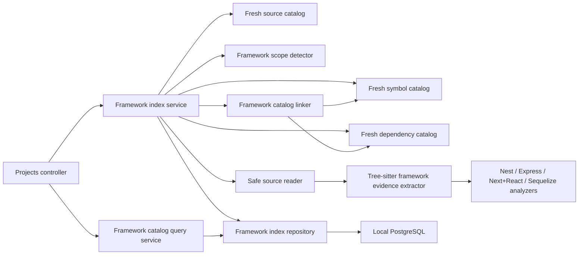

# Milestone 4.4 Architecture: Framework Understanding

Status: In progress. Milestones 4.4.1 and 4.4.2 are complete; Milestone 4.4.3 is next.

## Goal

Turn Arc's fresh source, symbol, and dependency catalogs into a durable, evidence-backed view of
the project's framework structure. The initial analyzers cover:

- NestJS modules, controllers, providers, routes, and static injection relationships.
- Express applications, routers, routes, middleware, and router mounts.
- Next.js App Router and Pages Router conventions.
- React components, client boundaries, and statically linked component composition.
- Sequelize models, attributes, initialization styles, and associations.

Milestone 4.4 describes code structure. It does not execute project code, infer runtime behavior,
generate embeddings, build prompts, edit files, or add VSCode controls.

## Decisions

- Framework analysis remains a backend responsibility in the Projects bounded context.
- A separate framework catalog owns framework entities and relationships. Symbol and dependency
  tables remain language-neutral.
- Every framework conclusion must retain static evidence: package metadata, a file convention, a
  normalized syntax range, or a link to a current symbol/dependency record.
- Tree-sitter parses hash-verified source transiently. Parser nodes and source bodies never cross
  the infrastructure boundary or enter PostgreSQL.
- Package imports and nearest `package.json` metadata activate analyzers. A class named
  `Controller` or a call named `get` is not enough by itself.
- Existing symbol UUIDs identify declarations where possible. Existing dependency edge and binding
  UUIDs identify cross-file imports where possible.
- Unchanged framework syntax is reusable by source hash and effective analyzer identity.
- Cross-file linking runs again for every framework index, including reused syntax evidence.
- Only static values are interpreted. Dynamic paths, tokens, options, and computed targets remain
  explicit unknowns rather than guessed values.
- One Sequelize transaction publishes the complete current framework catalog.
- Failed and interrupted runs preserve the previous usable catalog.
- Indexing is explicit. Source, symbol, or dependency indexing does not automatically trigger
  framework indexing.
- No framework package is loaded, executed, or added as an Arc runtime dependency.

## Why a Separate Catalog

The current symbol catalog knows declarations, names, lexical hierarchy, exports, and ranges. The
dependency catalog knows import bindings, specifiers, and resolved file targets. Neither catalog
retains the syntax needed to answer questions such as:

- Which NestJS class has `@Controller("users")`?
- Which method has `@Get(":id")`?
- Which Express router is mounted at `/api`?
- Is a Next.js file a page, layout, or route handler?
- Does a React function actually produce JSX?
- Which Sequelize model calls `hasMany`, and what static alias or foreign key does it declare?

Adding these fields to generic symbol or dependency rows would couple stable language-neutral
catalogs to framework releases and produce sparse, difficult-to-evolve tables. Milestone 4.4
therefore consumes those catalogs and publishes a separately versioned framework view.

## Grounding Model

Arc records evidence, not confidence scores.

Evidence kinds:

- `package_metadata`: an exact dependency name in a hash-verified `package.json`.
- `import_binding`: an existing dependency edge/binding to a known framework package.
- `decorator`: a decorator linked to a framework import.
- `call_expression`: a call whose receiver or function is linked to framework evidence.
- `class_heritage`: a class base linked to a framework import.
- `jsx`: JSX structure in a React-activated scope.
- `file_convention`: a documented Next.js path convention.
- `catalog_link`: a deterministic link between existing framework, symbol, or dependency facts.

Certainty values:

- `declared`: directly represented by static syntax or package metadata.
- `convention`: represented by a framework-owned file convention.
- `linked`: resolved by current symbol/dependency identities.
- `unresolved`: a valid framework form exists, but a static target or value cannot be determined.

Arc does not calculate percentage confidence. Consumers can distinguish exact, conventional,
linked, and unresolved facts without treating a heuristic number as truth.

## Scope

### Included

- JavaScript, JSX, TypeScript, and TSX.
- Multiple package scopes inside one registered project.
- ESM and supported CommonJS framework imports already represented by the dependency catalog.
- Stable entities and relationships with source provenance.
- Static route methods and route paths.
- Static framework registration arrays and option properties.
- Next.js route conventions under root or `src` application directories.
- Incremental evidence reuse and full relationship relinking.
- Limits, omissions, syntax-error state, atomic publication, restart recovery, and local
  PostgreSQL acceptance.
- Bounded framework catalog queries for later context retrieval.

### Not Included

- Executing decorators, configuration files, model factories, application bootstrap, or user code.
- TypeScript type checking, control-flow analysis, or arbitrary data-flow analysis.
- Runtime reflection metadata or dependency-injection container behavior.
- Custom NestJS route decorators unless their framework meaning is statically declared by a future
  analyzer.
- Express routes assembled through loops, mutation, computed method names, or arbitrary aliases.
- Complete Next.js interception, rewrite, redirect, middleware matcher, or build-configuration
  evaluation.
- React state, hook dependency, prop, event, or runtime render graphs.
- `sequelize-typescript` decorators in the initial Sequelize analyzer.
- Runtime database schema introspection or migration interpretation.
- MongoDB/Mongoose, GraphQL, React Native, Redis, jobs, ETL, or Business Central analyzers.
- General call, reference, inheritance, control-flow, or data-flow graphs.
- Embeddings, semantic search, prompt context, Ollama calls, tool execution, or file editing.
- VSCode framework controls, visual graph UI, filesystem watching, or automatic indexing.

## Component Boundary



Application and domain code receive Arc-owned records only. Tree-sitter nodes, captures, queries,
and parser lifecycle types remain inside infrastructure adapters.

## Freshness Boundary

Framework indexing requires a coherent upstream snapshot:

1. The project exists.
2. A current ready source catalog exists and still belongs to the latest usable inventory.
3. A current symbol catalog exists and references that exact source-index run.
4. A current dependency catalog exists and references that exact source-index run.
5. None of those upstream catalogs is currently being replaced.
6. The framework run records source, symbol, and dependency run UUIDs.
7. The same three current run UUIDs are rechecked immediately before publication.

Missing or mismatched inputs return a conflict before a framework run is created. A newer source,
symbol, or dependency publication makes the framework catalog stale until the user explicitly
indexes frameworks again.

Limited upstream catalogs are not silently treated as complete. Framework indexing may consume
their valid rows, but the resulting run is `limited` and carries one or more stable reasons:

- `source_catalog_limited`
- `symbol_catalog_limited`
- `dependency_catalog_limited`
- `upstream_file_gaps`

The status endpoint remains readable while stale. Catalog queries reject stale data so later
context building cannot mistake an old framework relationship for current project structure.

## Framework Scopes

A project can contain multiple applications and packages. The detector builds scopes from current,
hash-verified `package.json` files.

A scope contains:

- Stable scope key.
- Project-relative package root, with `.` representing the registered project root.
- Nullable package name.
- Detected framework.
- Evidence package path and source-file UUID.
- Detection evidence from dependency sections and/or current import edges.

Initial exact package signals:

- NestJS: `@nestjs/common` or `@nestjs/core`.
- Express: `express`.
- Next.js: `next`.
- React: `react`, or an already detected Next.js scope.
- Sequelize: `sequelize`.

The detector reads only `dependencies`, `devDependencies`, `peerDependencies`, and
`optionalDependencies`. Package scripts are not sufficient evidence by themselves. An exact
framework import can activate an analyzer for a file even when package metadata is absent, which
supports partial repositories and unusual workspaces.

Each source file belongs to its nearest package scope. Analyzer activation is recalculated on every
run. A package metadata change contributes to the scope context hash and invalidates reuse only for
affected scopes.

## Analysis Pipeline

For each current ready source file:

1. Select its nearest framework scopes.
2. Determine which analyzers are active from package and dependency evidence.
3. Calculate an effective analyzer identity from parser versions, query versions, active analyzers,
   limits, and scope context.
4. Reuse the prior normalized evidence when source hash, relative path, language, and effective
   identity match a reusable outcome.
5. Otherwise safely read the file and verify its current SHA-256 before parsing.
6. Parse the file once and run every active analyzer over that parser state.
7. Convert captures to Arc-owned entities, relationships, static attributes, omissions, and
   exclusive UTF-8 byte ranges.
8. Discard source text, parser state, and captures.
9. Relink both new and reused facts against the exact current symbol and dependency catalogs.
10. Publish the complete current framework catalog atomically.

One parser pass per changed file avoids reparsing a TSX file separately for Next.js, React, and
Sequelize evidence.

## Analyzer Rules

### NestJS

The NestJS analyzer follows imported bindings from `@nestjs/common` rather than matching decorator
text globally.

Initial entities:

- Modules from classes decorated with `@Module`.
- Controllers from classes decorated with `@Controller`.
- Providers from `@Injectable` classes and statically registered provider entries.
- HTTP routes from controller methods decorated with standard Nest HTTP method decorators.

Initial relationships:

- Module imports, controllers, providers, and exports from static `@Module` object arrays.
- Controller-to-route ownership.
- Provider/controller constructor injection when the token is a static identifier, string, or
  imported symbol.

Supported HTTP decorators include `Get`, `Post`, `Put`, `Patch`, `Delete`, `Options`, `Head`, and
`All`. Controller and method paths accept bounded static strings or arrays of static strings.
Controller and method paths are normalized and combined without executing decorators.

Dynamic module factories, computed decorator aliases, spread-heavy metadata, and runtime tokens are
retained only as unresolved evidence. Nest's documented controller and module semantics are the
reference boundary:

- <https://docs.nestjs.com/controllers>
- <https://docs.nestjs.com/modules>

### Express

The Express analyzer first proves the local binding came from `express`.

Initial entities:

- Applications created by `express()`.
- Routers created by `express.Router()` or a linked `Router` binding.
- Routes registered with standard HTTP methods or `all`.
- Middleware registrations through `use`.

Initial relationships:

- Application/router ownership of routes.
- Middleware registration.
- Router mounts when the mounted value resolves through an existing local dependency binding.
- Named handler linkage when a current symbol can be identified.

Static string route paths are normalized. Dynamic paths, regular expressions, arrays containing
dynamic values, computed receiver methods, and aliases that require general data-flow analysis are
marked unresolved.

Error middleware can be classified when a directly registered function has four parameters.
Conditional execution order and runtime reachability are not inferred. Express's documented
application/router middleware and `METHOD` registration model is the reference boundary:

- <https://expressjs.com/en/guide/routing.html>
- <https://expressjs.com/en/guide/using-middleware.html>

### Next.js and React

Next.js and React share one implementation gate because Next.js route files are React components
and both analyzers need the same JSX evidence.

Supported Next.js roots:

- `app` and `src/app`.
- `pages` and `src/pages`.

Initial App Router conventions:

- `page`, `layout`, `template`, `loading`, `error`, `global-error`, `not-found`, and `default`.
- `route` files with statically exported HTTP method handlers.
- Route groups omitted from public URL patterns.
- Dynamic, catch-all, and optional catch-all segments preserved as patterns.
- Private folders excluded from public route construction.
- Client boundaries from a top-level `"use client"` directive.

Initial Pages Router conventions:

- Page routes, nested routes, and `index` normalization.
- Dynamic and catch-all segments.
- `pages/api` route files.
- `_app`, `_document`, and `_error` as framework roles rather than ordinary public pages.

Parallel slots can be represented as convention entities without adding a URL segment. Intercepting
routes that cannot be normalized without runtime navigation context retain a nullable route pattern
and unresolved certainty.

Initial React entities:

- Exported PascalCase function, class, and variable components with direct JSX evidence.
- Default anonymous components when a Next.js file convention provides the owning role.
- Common direct `memo` and `forwardRef` wrappers linked to React imports.

Initial React relationships:

- Component-to-component render links for PascalCase JSX tags.
- Cross-file render targets only when dependency bindings and current symbols resolve the tag.
- Next page/layout ownership of its component.

Lowercase intrinsic elements are not component entities. Hook usage, props, state, event flow,
conditional render reachability, and arbitrary higher-order components are excluded.

Next.js file conventions and React's component rules are grounded in:

- <https://nextjs.org/docs/app/getting-started/project-structure>
- <https://nextjs.org/docs/pages/building-your-application/routing/pages-and-layouts>
- <https://react.dev/learn/your-first-component>

### Sequelize

The Sequelize analyzer follows bindings from `sequelize` and prioritizes the class-based and
factory-based styles used by the target user.

Initial model forms:

- A class extending a linked `Model` with `Model.init(...)`.
- A class extending `Model` with a static initializer that calls `this.init(...)`.
- `sequelize.define(modelName, attributes, options)`.
- A factory function that returns or assigns `sequelize.define(...)`.

Initial model attributes:

- Static attribute names.
- Direct `DataTypes` member names and bounded call forms such as `STRING(255)`.
- Static `allowNull`, `primaryKey`, `unique`, and `field` values.
- Static `modelName`, `tableName`, and `timestamps` options.

Initial associations:

- `hasOne`
- `belongsTo`
- `hasMany`
- `belongsToMany`

The analyzer records the static source model, target identifier or `models.target` member, alias,
foreign key, through model, source key, and target key when available. The linker resolves model
targets through current local imports and framework entities.

Computed attribute keys, spread values, runtime factory output, hooks, scopes, indexes, validations,
and `sequelize-typescript` decorators are not interpreted initially. Sequelize's documented class,
`init`, `define`, and association forms are the reference boundary:

- <https://sequelize.org/docs/v6/core-concepts/model-basics/>
- <https://sequelize.org/docs/v6/core-concepts/assocs/>

## Domain Model

Framework kinds:

- `nestjs`
- `express`
- `nextjs`
- `react`
- `sequelize`

Entity kinds:

- `module`
- `controller`
- `provider`
- `application`
- `router`
- `route`
- `middleware`
- `page`
- `layout`
- `route_handler`
- `component`
- `model`
- `model_attribute`

Relationship kinds:

- `contains`
- `registers_controller`
- `registers_provider`
- `imports_module`
- `exports_provider`
- `injects`
- `handles_route`
- `mounts_router`
- `uses_middleware`
- `renders_component`
- `defines_attribute`
- `associates`
- `wraps`

Every entity includes:

- Stable UUID and SHA-256 identity key.
- Framework and entity kind.
- Scope UUID.
- Bounded display name.
- Source-file UUID and project-relative path.
- Nullable current symbol UUID.
- Evidence kind and certainty.
- Nullable normalized range.
- A strict kind-specific attributes object.

Every relationship includes:

- Stable UUID and SHA-256 identity key.
- Framework and relationship kind.
- Source entity UUID.
- Nullable resolved target entity UUID.
- Nullable bounded unresolved target name.
- Evidence kind and certainty.
- Nullable source-file UUID, dependency edge UUID, symbol UUID, and normalized range.
- A strict kind-specific attributes object.

Kind-specific attributes are validated by shared discriminated-union contracts before persistence
and again before API output. PostgreSQL uses JSONB for these bounded attributes, but arbitrary
unvalidated JSON never enters the repository.

## Stable Identity

Entity identity keys are SHA-256 over:

```txt
framework + NUL + entityKind + NUL + scopeKey + NUL + sourceFileId + NUL +
normalizedSyntaxIdentity + NUL + semanticRole
```

Relationship identity keys are SHA-256 over:

```txt
framework + NUL + relationshipKind + NUL + sourceEntityIdentity + NUL +
targetIdentityOrStaticName + NUL + normalizedSyntaxIdentity + NUL + occurrence
```

Byte offsets are excluded from identity. Inserting unrelated lines does not replace stable UUIDs.
Changing a route path, Next.js route location, model name, or association target changes semantic
identity because it changes the framework fact itself.

## Incremental Model

File evidence is reusable when:

- The source file is still ready.
- Source-file UUID, path, language, and content hash are unchanged.
- The prior file status is reusable.
- The effective analyzer identity is unchanged.
- The file remains in the same effective framework scope.
- Prior facts fit the current per-file and total limits.

Failed and limited file outcomes are retried.

Relationship resolution is never reused as final output. Every run relinks all current facts
because:

- An import target can be added, removed, or retargeted.
- A symbol catalog can change without changing the consuming file.
- A package metadata change can activate or deactivate an analyzer.
- A NestJS module registration can gain a resolvable imported target.
- An Express router mount can retarget through an alias.
- A JSX tag can resolve to a different local component.
- A Sequelize association target can move between model files.

The common unchanged run performs zero code reads and zero Tree-sitter parses while still relinking
every relationship against the exact current upstream runs.

## Persistence Model

Milestone 4.4.6 will add migration `0007_project_framework_catalog.sql`.

### `project_framework_index_runs`

- Project, source-index, symbol-index, and dependency-index UUIDs.
- Status: `running`, `completed`, `limited`, or `failed`.
- Analyzer-set identity.
- Scope, analyzed, reused, unsupported, failed, entity, relationship, unresolved-link, and omission
  counts.
- Stable limit reasons, warnings, and nullable error code.
- Start and completion timestamps.

A partial unique index permits one running framework index per project.

### `project_framework_scopes`

- Stable UUID and scope key.
- Project and framework-index run UUIDs.
- Framework kind.
- Project-relative package root and nullable package name.
- Evidence package source-file UUID and path.
- Scope context hash.

### `project_framework_files`

- Stable UUID.
- Project, framework-index run, scope, and source-file UUIDs.
- Relative path, source hash, language, and effective analyzer identity.
- Status, syntax-error flag, entity/relationship/omission counts, nullable error code, and analyzed
  timestamp.

There is one current row per analyzed source file. Files outside detected scopes do not need empty
rows.

### `project_framework_entities`

- Stable UUID.
- Project, run, scope, framework-file, and source-file UUIDs.
- Identity key, framework kind, entity kind, name, relative path, and nullable symbol UUID.
- Evidence kind, certainty, nullable range, and validated bounded JSONB attributes.

### `project_framework_relationships`

- Stable UUID.
- Project, run, scope, source entity, and nullable target entity UUIDs.
- Identity key, framework and relationship kind.
- Nullable unresolved target name.
- Evidence kind, certainty, and validated bounded JSONB attributes.
- Nullable source-file, symbol, dependency-edge, and range provenance.

No framework table stores source bodies, comments, syntax trees, full decorator text, full call
expressions, absolute paths, TypeScript diagnostics, or failed lookup paths.

## Atomic Publication

Analysis and linking happen outside the publication transaction. One Sequelize transaction then:

1. Locks the running framework-index row.
2. Upserts current scopes by stable scope key.
3. Upserts file outcomes by project/source identity.
4. Upserts entities by project/identity key.
5. Upserts relationships by project/identity key.
6. Removes relationships, entities, files, and scopes absent from the replacement catalog.
7. Completes the run as `completed` or `limited`.

Any failure rolls back the complete replacement. The run is marked failed outside that transaction,
and the previous catalog remains intact.

## Limits and Scheduling

Configuration uses bounded environment values for:

- Maximum entities per file.
- Maximum relationships per file.
- Maximum total entities.
- Maximum total relationships.
- Maximum entity/target name bytes.
- Maximum static route/model attribute bytes.
- Maximum JSONB attribute bytes.
- Maximum package metadata bytes.
- Batch size.
- Files processed before yielding to the event loop.
- Catalog query entity and relationship ceilings.

Names and static values are omitted, never truncated. Per-file limit violations produce a durable
limited file. Total limits stop new facts deterministically and complete the run as limited.
Analysis and relinking yield periodically so local chat remains responsive on the target Intel Mac.

## API

Index and status endpoints:

- `POST /projects/:projectId/frameworks/index`
- `GET /projects/:projectId/frameworks/index`

Catalog endpoint:

- `GET /projects/:projectId/frameworks/catalog`

Initial catalog filters:

- Optional repeated or comma-separated `framework`.
- Optional repeated or comma-separated `kind`.
- Optional exact portable project-relative `path`.
- Optional scope path, with `.` representing the project root.
- `includeRelations`, defaulting to `false`.
- Bounded `maxEntities` and `maxRelationships`.

The response includes input run provenance, scopes, sorted entities, optional sorted relationships,
and independent entity/relationship truncation flags. Sorting is stable by scope root, framework,
path, start byte, kind, and UUID.

Stable HTTP behavior:

- `400` for invalid UUIDs, paths, filters, or bounds.
- `404` for an unknown project.
- `409` for missing, stale, or currently replacing source/symbol/dependency/framework catalogs.
- `503` for analyzer, safe-read, linking, or persistence failures.

An empty valid filter returns an empty catalog, not `404`.

## Failure and Recovery

Run-level errors:

- `analyzer_unavailable`
- `upstream_catalog_changed`
- `framework_persistence_error`
- `index_interrupted`
- `unknown_error`

File-level errors:

- `source_changed`
- `source_read_error`
- `unsupported_language`
- `parse_error`
- `framework_limit`
- `framework_text_limit`

Dynamic or unresolved framework evidence is data, not a failed run.

On backend bootstrap, abandoned running framework indexes become
`failed/index_interrupted`. Recovery never modifies current scopes, files, entities, or
relationships.

## Security and Privacy

- Read only current ready source-catalog files.
- Reuse the existing safe source reader and exact-hash verification.
- Deny symbolic links, root escapes, ignored files, binary content, invalid UTF-8, and oversized
  files before parsing.
- Read package metadata only through bounded, hash-verified catalog entries.
- Never execute source, import packages, instantiate Nest applications, mount Express routers,
  render React, load Next.js configuration, initialize Sequelize, or connect to an application
  database.
- Do not send source or framework evidence to Ollama.
- Do not log source excerpts, decorator arguments, call text, model definitions, or absolute paths.
- Return project-relative paths and bounded static values only.

## Class and Module Design

Application:

- `ProjectFrameworkIndexService`: freshness, scope selection, reuse, safe reads, extraction,
  relinking, limits, and publication orchestration.
- `ProjectFrameworkCatalogService`: bounded fresh catalog queries.
- `ProjectFrameworkIndexRepository`: run lifecycle, reusable evidence, atomic publication,
  recovery, and bounded catalog reads.
- `ProjectFrameworkScopeDetector`: package/import evidence and nearest-package scope selection.
- `SourceFrameworkEvidenceExtractor`: parser-neutral transient extraction port.
- `ProjectFrameworkCatalogLinker`: symbol/dependency linking without parser types.

Infrastructure:

- `TreeSitterFrameworkEvidenceExtractor`: one parser pass and analyzer registry.
- `TreeSitterNestFrameworkAnalyzer`.
- `TreeSitterExpressFrameworkAnalyzer`.
- `NextFrameworkConventionAnalyzer`.
- `TreeSitterReactFrameworkAnalyzer`.
- `TreeSitterSequelizeFrameworkAnalyzer`.
- `SequelizeProjectFrameworkIndexRepository`.

Presentation:

- Existing `ProjectsController`: index, status, and catalog endpoints.

The NestJS module uses explicit class providers and existing symbol constants. No Nest-specific
Sequelize decorator layer, second ORM, graph database, or runtime framework dependency is added.

## Planned Files

Create:

- `packages/contracts/src/api/project-framework-index.contract.ts`
- `packages/contracts/src/api/project-framework-index.contract.test.ts`
- `packages/contracts/src/api/project-framework-catalog.contract.ts`
- `packages/contracts/src/api/project-framework-catalog.contract.test.ts`
- `apps/ai-server/migrations/0007_project_framework_catalog.sql`
- Five class-based Sequelize models for runs, scopes, files, entities, and relationships.
- Framework domain types, repository port, index service, query service, detector, extractor port,
  and linker.
- Tree-sitter analyzer registry and framework-specific analyzers/tests.
- Sequelize repository and tests.
- `apps/ai-server/src/cli/framework-index-verify.ts`

Modify:

- Contracts barrel exports.
- Database types and model initialization.
- Project errors, constants, module, and controller.
- Configuration schema/tests and `.env.example`.
- Root and backend package scripts.
- README and architecture/milestone documentation.

No VSCode extension or webview file changes are planned for Milestone 4.4.

## Dependency Changes

No new runtime dependency is planned. Milestone 4.4 reuses:

- Tree-sitter and the pinned JavaScript/TypeScript grammars.
- TypeScript-backed dependency results from Milestone 4.3.
- Sequelize and local PostgreSQL.

Framework packages remain fixture text only and are never installed into Arc.

## Implementation Gates

### 4.4.1 Framework Evidence Foundation and Scope Detection

Status: Complete.

Delivered:

- Framework-neutral scope, import-binding, syntax-evidence, static-value, limit, and omission
  contracts.
- Hash-verified package metadata detection with nearest-package monorepo scopes and import-only
  activation.
- Exact ESM and supported CommonJS framework binding resolution with alias preservation and
  type-only, local, and unrelated dependency rejection.
- A parser-neutral evidence port and shared Tree-sitter adapter for decorators, calls, class
  heritage, JSX tags, directives, and bounded static values.
- Versioned JavaScript, JSX, TypeScript, and TSX query identities, stable offset-independent
  evidence keys, malformed-tree tolerance, and exclusive UTF-8 ranges.
- Paged, deterministic, immutable-run symbol and dependency catalog readers with optional binding
  loading.
- Development and compiled framework-evidence smoke commands.
- Unit coverage for monorepo scoping, aliases, false-positive rejection, syntax errors, Unicode,
  privacy, limits, deterministic identities, and repository run isolation.

No framework-specific entity extraction, migration, database write, REST endpoint, or VSCode
change was added.

### 4.4.2 NestJS Analyzer

Status: Complete.

Delivered:

- Framework-neutral entity, relationship, certainty, omission, analyzer-limit, and transient
  analysis-result contracts.
- Shared offset-independent entity and relationship identity generation.
- A class-based NestJS analyzer that accepts decorators only through exact runtime
  `@nestjs/common` bindings, including named aliases and namespace imports.
- Transient module, controller, provider, and HTTP route facts for `Get`, `Post`, `Put`, `Patch`,
  `Delete`, `Options`, `Head`, and `All`.
- Static controller and method string/array paths with deterministic normalization and Cartesian
  route composition.
- Static module imports, controllers, providers, custom provider tokens, and exports with
  same-file linking and dependency-edge provenance.
- Explicit `@Inject` string/identifier tokens and ordinary typed constructor injection, with
  parameter ownership and explicit-token precedence.
- Conservative unresolved facts and omissions for dynamic paths, calls, spreads, computed
  metadata, and runtime tokens.
- Coverage for aliases, namespace decorators, type-only and unrelated false positives, malformed
  syntax, limits, source privacy, stable identities after source movement, and native development
  smoke compatibility.

No Express, Next.js, React, Sequelize, migration, database write, API, or VSCode change was added.

### 4.4.3 Express Analyzer

Status: Planned.

- Implement framework-bound application/router creation, routes, middleware, error middleware, and
  local router mounts.
- Prove ESM/CommonJS imports, aliases, chained routes, static and dynamic paths, mount linking,
  stable identities, and false-positive rejection.
- No Next.js, React, Sequelize, migration, database write, API, or VSCode change.

### 4.4.4 Next.js and React Analyzers

Status: Planned.

- Implement App Router and Pages Router conventions, route handlers, dynamic segments, route
  groups, special files, and client boundaries.
- Implement evidence-backed React components, direct wrappers, and JSX composition links.
- Prove root and `src` layouts, page/API routes, intrinsic-element exclusion, imported component
  linking, unresolved advanced conventions, stable identities, and false-positive rejection.
- No Sequelize, migration, database write, API, or VSCode change.

### 4.4.5 Sequelize Analyzer

Status: Planned.

- Implement class-based `Model.init`, static `this.init`, `sequelize.define`, and factory-style
  model detection.
- Implement bounded static attributes/options and `hasOne`, `belongsTo`, `hasMany`, and
  `belongsToMany` relationships.
- Prove the user's class-based and legacy factory/`associate(models)` styles, aliases, foreign keys,
  through models, dynamic omissions, stable identities, and false-positive rejection.
- No migration, database write, API, or VSCode change.

### 4.4.6 Durable Incremental Framework Catalog

Status: Planned.

- Add migration `0007_project_framework_catalog.sql`, class-based Sequelize models, repository,
  orchestration service, status contracts/API, configuration, and recovery.
- Require coherent source/symbol/dependency provenance.
- Reuse unchanged evidence with zero source reads/parses while relinking every relationship.
- Publish scopes, file outcomes, entities, and relationships in one transaction.
- Prove limits, upstream gaps, stale cleanup, stable UUIDs, rollback, privacy, and restart recovery.
- No public catalog query, PostgreSQL acceptance CLI, automatic indexing, or VSCode change.

### 4.4.7 Framework Catalog Query and Acceptance

Status: Planned.

- Add strict bounded catalog query/response contracts and the fresh catalog endpoint.
- Add `pnpm framework:index:verify` against local PostgreSQL.
- Prove a multi-package NestJS/Express/Next.js/React/Sequelize fixture, deterministic queries,
  relinking without reparsing, stale rejection, limits, rollback, recovery, privacy, and cleanup.
- Run full tests, lint, formatting, TypeScript build, webview type-check/build, native parser
  smokes, and local PostgreSQL verification.
- No VSCode framework UI or automatic indexing.

Each implementation gate requires explicit approval and must compile and pass independently before
the next gate begins.

## Acceptance Gate

- Framework analyzers activate only from exact package/import evidence or documented Next.js file
  conventions inside a detected Next.js scope.
- JavaScript, JSX, TypeScript, and TSX fixtures produce deterministic framework facts.
- NestJS decorators are linked to `@nestjs/common` imports and do not match unrelated local names.
- Express receivers are linked to `express` creation or imported routers.
- Next.js routes normalize common App and Pages Router conventions without executing configuration.
- React components require JSX or an owning Next.js convention; lowercase intrinsic elements are
  not components.
- Sequelize class and factory models plus static associations support the user's established code
  styles without executing model initialization.
- Dynamic values remain unresolved or omitted with counters; they are never guessed.
- Unchanged evidence performs zero source reads and zero Tree-sitter parses.
- Every relationship is relinked against the exact current symbol/dependency catalogs.
- Entity and relationship UUIDs survive unrelated source movement and relationship-only changes.
- Successful publication is atomic; failed and interrupted runs preserve the previous catalog.
- Catalog queries are deterministic, bounded, and restricted to fresh provenance.
- PostgreSQL and API responses contain no source bodies, syntax trees, absolute paths, diagnostics,
  or failed lookup paths.
- The full workspace and local PostgreSQL verification gates pass.

## Future Milestones

- Milestone 4.5 adds explicit VSCode controls, progress, durable status, and final source
  intelligence acceptance.
- Milestone 5 adds embeddings and semantic retrieval over bounded, separately approved content
  representations. It does not change Milestone 4.4's evidence model.
