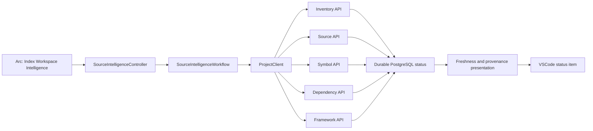

# Milestone 4.5 Architecture: Source Intelligence Integration

Status: Complete.

## Goal

Expose the complete source-intelligence pipeline as one explicit VSCode workflow while preserving
the independent backend boundaries delivered by Milestones 4.1 through 4.4.

The user can start indexing, see the current stage, reload the extension, and still see a truthful
status derived from durable backend records.

## Decisions

- The Extension Host orchestrates; the backend services remain independently callable.
- The workflow runs inventory, source, symbols, dependencies, and frameworks in dependency order.
- Existing durable run and catalog records are the source of truth. There is no duplicate
  aggregate run table.
- Status is ready only when every current catalog is fresh and its provenance IDs form one exact
  chain.
- Indexing is explicit. Activation, editor changes, timers, and filesystem events never start it.
- Local duplicate suppression improves UX; backend one-running-run constraints remain
  authoritative.
- Source bodies, syntax trees, diagnostics, and absolute dependency paths never enter VSCode.

## Component Shape



`ProjectClient` validates every response with the existing shared Zod contracts. The workflow
depends on a narrow indexing port, making stage order and failure behavior testable without VSCode.
The controller owns folder selection, registration guards, progress, duplicate suppression,
completion messages, and status-bar lifecycle.

## Explicit Workflow

1. Select the active local workspace or ask in a multi-root workspace.
2. Require an existing Arc project registration.
3. Run a fresh metadata inventory.
4. Fingerprint safe source files from that inventory.
5. Extract or reuse language-neutral symbols.
6. extract or reuse declarations and resolve the dependency graph.
7. Analyze or reuse framework evidence and relink the current framework catalog.
8. Reload all durable status resources and present the resulting state.

`limited` results remain usable and the workflow continues. A `failed` or unexpected `running`
response stops downstream work. HTTP conflicts and service failures also stop the workflow and use
the backend's safe public error boundary.

## Progress

The notification reports five stable stages:

- Scanning repository metadata.
- Fingerprinting safe source files.
- Extracting symbols.
- Resolving dependencies.
- Understanding framework structure.

Backend publication is atomic, so the extension does not invent file-level percentages. The
status item remains clickable and points to the same command.

## Durable Status

On activation, active-editor changes, workspace-folder changes, registration, and workflow
completion, the extension loads:

```txt
GET /projects/:projectId/inventory/scan
GET /projects/:projectId/sources/index
GET /projects/:projectId/symbols/index
GET /projects/:projectId/dependencies/index
GET /projects/:projectId/frameworks/index
```

Ready requires:

- A terminal usable inventory.
- A non-stale source catalog that references that inventory.
- A non-stale symbol catalog that references that source run.
- A non-stale dependency catalog that references that source run.
- A non-stale framework catalog that references those exact source, symbol, and dependency runs.

The presentation distinguishes:

- `Intelligence ready`
- `Index required`
- `Indexing`
- `Index limited`
- `Index failed`
- `Index unavailable`

An interrupted backend run is recovered by its owning backend service. The extension simply
restores the resulting durable failed state; it does not retry automatically.

## Controls

- Command Palette: `Arc: Index Workspace Intelligence`
- Arc chat-view title action: `$(symbol-structure)`
- Clickable source-intelligence status item
- Registration completion action: `Index now`

The lower-level `Arc: Scan Workspace` command remains available for metadata-only rescans.

## Failure Boundaries

- Non-file workspaces are rejected before network calls.
- Unregistered folders offer the explicit registration command.
- One extension host does not start duplicate workflows for the same project.
- Backend `409` responses remain authoritative across multiple clients.
- Invalid response payloads are rejected by shared contracts.
- Backend unavailability changes the status presentation but never triggers hidden work.
- Failure at any stage prevents dependent stages from running.
- Previous complete backend catalogs remain available after publication failure or restart.

## Acceptance

- Client methods use the correct endpoint, HTTP method, and response schema.
- Workflow tests prove deterministic stage order, limit propagation, and stop-on-failure behavior.
- Presentation tests prove absent, stale, running, failed, limited, fresh, and mismatched-provenance
  states.
- Extension host and webview type-check and production builds pass.
- Full tests, lint, formatting, and TypeScript build pass.
- Native Tree-sitter and TypeScript resolver compiled smokes pass.
- Local PostgreSQL source, symbol, dependency, and framework verification passes through
  `pnpm source:intelligence:verify`.

## Non-Goals

- Automatic or background indexing.
- Filesystem watching or incremental scheduling.
- Cancellation of an in-flight atomic backend stage.
- Source, graph, or framework browsing UI.
- Embeddings, chunks, semantic search, retrieval, or prompt assembly.
