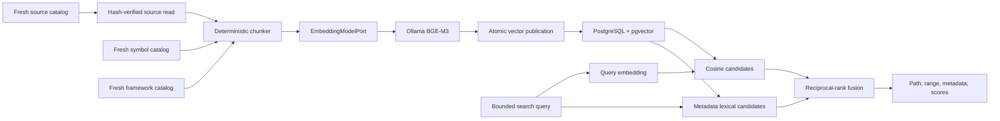

# Milestone 5 Architecture: Embeddings and Semantic Retrieval

Status: Approved. Milestones 5.1 and 5.2 complete.

## Goal

Turn Arc's fresh source-intelligence catalogs into a local, incremental semantic index that can
find relevant code without storing raw source chunks in PostgreSQL or sending the repository to a
cloud service.

Milestone 5 delivers embedding infrastructure and retrieval. Prompt construction and automatic
chat context remain Milestone 6.

## Current Environment Audit

- PostgreSQL `18.4` is installed through Homebrew.
- The local PostgreSQL server is healthy.
- pgvector `0.8.5` is installed and enabled by migration `0009_pgvector_extension.sql`.
- Ollama is healthy with `bge-m3` installed.
- Arc has an embedding provider port and compatibility smokes, but no project vector schema or
  retrieval API yet.

Milestone 5.1 installed:

```bash
brew install pgvector
ollama pull bge-m3
```

Homebrew's current pgvector formula supports PostgreSQL 18, including Intel macOS bottles. BGE-M3
is a 567M embedding model distributed by Ollama with a 1,024-dimensional output and an 8K context
window.

References:

- [Ollama embedding API](https://docs.ollama.com/api/embed)
- [Ollama BGE-M3 model](https://ollama.com/library/bge-m3)
- [Homebrew pgvector formula](https://formulae.brew.sh/formula/pgvector)
- [pgvector Sequelize integration](https://github.com/pgvector/pgvector-node)

## Decisions

- Use a separate embedding model from the chat model.
- Start with `bge-m3` and exactly 1,024 dimensions.
- Use Ollama's batch `/api/embed` endpoint with `truncate: false`.
- Use cosine distance for dense retrieval.
- Persist vectors and bounded metadata, never raw chunk text.
- Re-read source and verify its source-catalog hash when a later context builder needs text.
- Build lexical ranking only from already-approved metadata such as path, language, symbols, and
  framework entities. Do not persist a source-body `tsvector`.
- Require one coherent source, symbol, dependency, and framework provenance chain.
- Reuse unchanged vectors by content, chunker, model, dimensions, and input-format identity.
- Publish a complete vector catalog atomically; failure preserves the previous catalog.
- Keep indexing explicit. No watcher, timer, or background embedding worker is added.
- Keep Redis out of this milestone. The existing bounded synchronous workflow is sufficient for
  one local user.

## Privacy Boundary

Milestone 5 is the first Arc milestone that sends source content to a model. The configured Ollama
embedding adapter receives one bounded chunk at a time or a small bounded batch.

Persisted:

- Relative path and language.
- Source file and immutable source-index provenance.
- Exclusive byte/line range.
- Content and chunk hashes.
- Stable chunk identity.
- Owning symbol/framework identifiers where available.
- Embedding provider/model identity and dimensions.
- A 1,024-dimensional vector.
- Counters, limits, statuses, and safe error codes.

Transient only:

- Raw source file content.
- Raw chunk text.
- Ollama embedding request bodies.
- Parser state.
- Failed lookup paths.
- Query text after its query vector is produced.

Never logged or returned by the retrieval API:

- Raw chunk text.
- Full vectors.
- Absolute project paths.
- Ollama request bodies.

Vectors are sensitive derived project data. They remain in the same local PostgreSQL database and
are deleted through project cascade cleanup.

## Architecture



## Module Boundaries

`modules/embeddings` owns provider-neutral vector generation:

- Embedding model port.
- Provider status.
- Embedding request and result types.
- Ollama protocol adapter.
- Provider error normalization.

`modules/projects` owns repository-specific semantic indexing:

- Fresh catalog reads.
- Safe source rehydration.
- Chunking.
- Incremental vector publication.
- Semantic and hybrid search.
- Project endpoints and lifecycle status.

The chat module does not consume retrieval results in Milestone 5.

## Embedding Provider Contract

The application port accepts:

- `purpose`: `document` or `query`.
- A non-empty bounded list of strings.
- Expected dimensions.
- Abort signal.

It returns:

- One finite vector per input.
- Exact dimensions.
- Provider/model/input-format identity.
- Optional safe usage counters.

The Ollama adapter:

- Uses `ARC_OLLAMA_EMBEDDING_MODEL`, separate from `ARC_OLLAMA_MODEL`.
- Sends `truncate: false` so oversized chunks fail instead of silently changing meaning.
- Validates response count, dimensions, finite values, and model identity.
- Uses small batches suitable for the target Intel Mac.
- Owns provider-specific query/document formatting and versions that formatting in its identity.
- Never logs input strings or returned vectors.

## Chunking

Chunking is deterministic and provider-neutral:

1. Consume only `ready` files from one immutable source catalog.
2. Reapply ignore policy in the indexing orchestrator and safely re-read the file.
3. Require the read SHA-256 to equal the source-catalog hash.
4. Prefer complete durable symbol ranges when they fit.
5. Split oversized symbols on UTF-8-safe line boundaries.
6. Cover files without symbols through bounded line windows.
7. Drop whitespace-only chunks.
8. Add a transient metadata header containing relative path, language, and owning symbol.
9. Hash the exact embedding input before discarding it.

Default design limits:

- Maximum chunk source bytes: `8,192`.
- Maximum chunks per file: `500`.
- Maximum total chunks per project: `50,000`.
- Embedding batch size: `4`.
- Periodic event-loop yield after each bounded file group.

Chunk identity excludes database run IDs and byte offsets where possible. It includes project path,
source content hash, chunk content hash, owning semantic role, occurrence, and chunker identity.

## Durable Catalog

Migration `0010_project_embeddings.sql` will add:

### `project_embedding_index_runs`

- Project ID.
- Source, symbol, dependency, and framework run IDs.
- Provider/model/input-format/chunker identities.
- Dimensions.
- Lifecycle status and safe error code.
- File, chunk, embedded, reused, failed, and omission counters.
- Limit reasons and timestamps.

### `project_embedding_files`

- Project/source file IDs.
- Source hash and relative path.
- Chunker/provider identity.
- File status, chunk count, error code, and indexed timestamp.

### `project_embedding_chunks`

- Stable chunk UUID and identity key.
- Project, source file, and current embedding run IDs.
- Relative path, language, source hash, and chunk hash.
- Exclusive byte/line range.
- Optional owning symbol ID.
- Bounded metadata search document derived only from path/language/symbol/framework metadata.
- `vector(1024)` embedding.

Indexes:

- Stable unique identities.
- Project/run/path/range lookup.
- GIN metadata search.
- HNSW cosine vector search.

The repository will use the official `pgvector` Sequelize integration while preserving Arc's
class-based Sequelize models and transaction patterns.

## Incremental Publication

- A new run snapshots exact upstream provenance and provider/chunker identities.
- Unchanged chunks reuse prior vectors without contacting Ollama.
- Changed or new chunks are embedded outside the publication transaction.
- Every vector is validated before persistence.
- Upstream freshness is rechecked immediately before publication.
- One transaction upserts stable files/chunks, removes stale rows, and completes the run.
- Provider or database failure marks only the new run failed.
- Backend restart converts abandoned runs to `index_interrupted`.
- Project deletion cascades through all embedding rows.

Changing the embedding model, model digest, dimensions, input formatting, or chunker identity
invalidates vector reuse.

## Retrieval

### Dense Search

- Embed one bounded query with `purpose: query`.
- Require the current embedding catalog and exact current upstream provenance.
- Query pgvector using cosine distance.
- Apply project and optional path/language filters before ranking.
- Use bounded candidates and deterministic path/range/UUID tie-breaking.

### Metadata Lexical Search

Search only approved metadata:

- Relative path segments.
- Language.
- Symbol name, qualified name, and kind.
- Framework and entity names/kinds.

No source-body lexical index is persisted.

### Hybrid Ranking

- Retrieve independent dense and lexical candidate lists.
- Fuse them using reciprocal-rank fusion with a versioned constant.
- Deduplicate by stable chunk identity.
- Return dense, lexical, and fused scores plus their ranks.
- Keep candidate and result limits explicit in the response.

The public API returns paths, ranges, metadata, scores, provenance, and truncation only. Milestone
6 will safely rehydrate selected ranges and enforce prompt token budgets.

## API Shape

Planned endpoints:

```txt
GET  /providers/ollama/embeddings/status
POST /projects/:projectId/embeddings/index
GET  /projects/:projectId/embeddings/index
POST /projects/:projectId/embeddings/search
```

Search uses POST because query text is sensitive and should not enter URLs, access logs, or browser
history.

## Sub-Milestones

### 5.1 Local Embedding and pgvector Compatibility

Status: Complete.

- Install and enable pgvector for local PostgreSQL 18.
- Add separate embedding configuration and provider-neutral contracts.
- Implement and test the Ollama BGE adapter.
- Add embedding-provider and pgvector compatibility smokes.
- Add migration `0009_pgvector_extension.sql`.
- Persist no project vectors or source text.

### 5.2 Deterministic Safe Chunking

Status: Complete.

- Add chunk contracts and stable identities.
- Add symbol-aware and line-window chunking.
- Prove UTF-8 ranges, limits, malformed text handling, and hash drift rejection.
- Make all source/chunk text transient.

### 5.3 Durable Incremental Vector Catalog

- Add the official `pgvector` Node package.
- Add embedding run/file/chunk migration and class-based Sequelize models.
- Add atomic publication, vector reuse, limits, failure preservation, and restart recovery.
- Add explicit index/status endpoints.

### 5.4 Bounded Semantic Search

- Add query/result contracts.
- Add query embedding and pgvector cosine retrieval.
- Add filters, deterministic ordering, freshness, and truncation.

### 5.5 Metadata Hybrid Search

- Add metadata lexical candidates and reciprocal-rank fusion.
- Prove ranking, deduplication, limits, and source-body privacy.

### 5.6 VSCode Integration and Acceptance

- Add embeddings as the sixth explicit source-intelligence stage.
- Restore durable embedding status in the extension.
- Add local PostgreSQL/Ollama acceptance covering reuse, invalidation, search quality, rollback,
  recovery, privacy, and cleanup.

Each gate must compile and pass independently before the next gate begins.

## Milestone 5.1 Delivered

Files to create:

- `packages/contracts/src/api/embedding-provider-status.contract.ts`
- `apps/ai-server/migrations/0009_pgvector_extension.sql`
- `apps/ai-server/src/modules/embeddings/application/embedding-model.port.ts`
- `apps/ai-server/src/modules/embeddings/domain/embedding-model.types.ts`
- `apps/ai-server/src/modules/embeddings/domain/embedding-model.errors.ts`
- `apps/ai-server/src/modules/embeddings/infrastructure/ollama/ollama-embedding.adapter.ts`
- `apps/ai-server/src/modules/embeddings/infrastructure/ollama/ollama-embedding.schemas.ts`
- Focused contract, configuration, adapter, and controller tests.
- `apps/ai-server/src/modules/embeddings/embeddings.module.ts`
- `apps/ai-server/src/modules/embeddings/presentation/embedding-provider-status.controller.ts`
- `apps/ai-server/src/cli/embedding-smoke.ts`
- `apps/ai-server/src/cli/pgvector-smoke.ts`

Files to modify:

- `.env.example`
- `package.json`
- `packages/contracts/src/index.ts`
- `apps/ai-server/package.json`
- `apps/ai-server/src/config/env.ts`
- `apps/ai-server/src/config/env.test.ts`
- `apps/ai-server/src/app.module.ts`
- Database migration verification and documentation.

The Node pgvector package is deferred to Milestone 5.3, where Arc first adds a Sequelize vector
model. Milestone 5.1 uses PostgreSQL's native vector SQL directly.

External prerequisites completed:

- `brew install pgvector`
- `ollama pull bge-m3`

## Milestone 5.2 Delivered

- Added one class-based `ProjectSourceChunker` in the Projects module.
- Reused the existing symlink-safe, inventory-aware, bounded UTF-8 source reader.
- Required the reread SHA-256 to match the immutable source-catalog hash.
- Preferred complete non-overlapping symbol ranges and split oversized ranges on UTF-8-safe line
  boundaries.
- Covered source outside symbols with the same bounded line windows and discarded whitespace-only
  chunks.
- Added offset-stable chunk identities, exact input/content hashes, relative metadata headers,
  8 KiB source slices, and a 500-chunk per-file limit.
- Kept source text and embedding inputs transient; no migration, model, endpoint, or embedding call
  was added.
- Added focused tests for symbols, fallback coverage, UTF-8 ranges, limits, stable identities, and
  source drift.

Ignore-policy reapplication, whole-project chunk limits, batching, and atomic publication belong to
the Milestone 5.3 indexing orchestrator.

## Acceptance

- The configured embedding model is separate from the chat model.
- Missing configuration, unreachable Ollama, missing model, timeout, cancellation, dimension
  mismatch, malformed responses, and oversized input have typed safe failures.
- pgvector is installed in local PostgreSQL and supports 1,024-dimensional storage and cosine
  ordering.
- No source or query text is stored in PostgreSQL or logs.
- Unchanged chunks do not contact Ollama.
- Changed files invalidate only affected chunks.
- Every result belongs to one fresh immutable provenance chain.
- Retrieval is deterministic and bounded.
- Failed and interrupted publication preserves the previous catalog.
- Project deletion removes all vector rows.
- The full workspace, compiled backend, local PostgreSQL, local Ollama, and VSCode gates pass.

## Future Boundary

Milestone 6 builds the context selector:

- Rehydrate only selected ranges.
- Verify source hashes again.
- Enforce model token budgets.
- Combine semantic, graph, framework, open-editor, and conversation signals.
- Attach bounded project context to chat requests.

Milestone 5 does not alter prompts or send retrieval results to the chat model.
