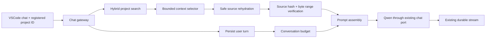

# Milestone 6 Architecture: Grounded Project Chat

Status: Complete.

## Goal

Give local chat a small, relevant, hash-verified view of the registered project while preserving
the existing durable streaming flow.

Milestone 6 selects context at request time. It does not add persistence for source text,
retrieval-query copies, prompt bodies, or assembled context. Existing durable conversation
messages remain unchanged.

## Starting Boundary

Arc already has:

- A VSCode workspace-to-project mapping.
- Durable chat sessions and idempotent streaming requests.
- Fresh source, symbol, dependency, framework, and embedding catalogs.
- Bounded hybrid search returning relative paths, source hashes, and byte ranges.
- A symlink-safe source reader that verifies inventory metadata and computes SHA-256.

Chat currently sends only `requestId`, `sessionId`, and `content`. The backend forwards the latest
40 completed messages to Ollama without a token budget or project context.

## Decisions

- Add the registered `projectId` to each chat send command. Do not send an absolute workspace path.
- Keep context selection in the backend so future clients use the same retrieval and safety rules.
- Use the current user message as the initial retrieval query.
- Re-read selected files from the registered project root and require the current source hash.
- Slice source by the durable exclusive UTF-8 byte range after verification.
- Treat repository content as untrusted reference data, never as model instructions.
- Enforce one deterministic request budget before calling the chat model.
- Use a simple local character estimator with reserved output headroom and set Ollama's `num_ctx`
  as the provider ceiling; do not add a tokenizer dependency in the first version.
- Preserve normal chat when no project is registered or usable context is unavailable.
- Keep selection transient and log only counts, durations, safe reason codes, and token estimates.
- Keep Redis, background retrieval, prompt persistence, automatic indexing, and a new database
  table out of this milestone.

## Request Flow



The gateway still owns request validation, cancellation, replay, and emitted events. A dedicated
context service owns retrieval and source access. The durable conversation service owns history
selection. The inference adapter remains provider-specific.

## Transport Contract

`ChatSendCommand` gains:

```ts
projectId?: string;
```

The field is optional for protocol compatibility and for chat outside a registered workspace. The
extension resolves it from the preferred workspace folder and `WorkspaceProjectStore` at send
time.

The backend validates that the project exists. It never accepts a client-supplied root path,
source text, retrieval score, or source range.

## Context Selection

The selector performs:

1. Search the current project with the current user message.
2. Request a small candidate set from the existing hybrid search service.
3. Walk candidates in deterministic rank order.
4. Deduplicate overlapping ranges from the same source file.
5. Rehydrate each candidate through the registered project and current source catalog.
6. Skip stale, missing, unsafe, invalid, or over-budget candidates.
7. Return selected snippets plus safe metadata and budget usage.

The initial selector uses semantic and metadata rank only. Dependency neighbors, framework
relationships, and active-editor hints are a later gate.

## Safe Rehydration

Rehydration resolves all filesystem access server-side:

- Load the registered project and current source catalog.
- Require the search result to reference that exact source catalog.
- Find the source file by ID and relative path.
- Read the full indexed file through `SourceTextReader`.
- Require the observed hash to equal both the source-file and search-result hashes.
- Validate `0 <= startByte < endByte <= fileBytes`.
- Slice the verified UTF-8 bytes and enforce per-snippet and total byte limits.

The service fails closed for an individual candidate. One stale file does not fail ordinary chat;
it is omitted and represented by a safe reason code.

## Prompt Shape

The model receives messages in this order:

1. One Arc system instruction.
2. One transient project-reference message when snippets exist.
3. Budgeted completed conversation history ending with the current user message.

The system instruction states that project snippets are untrusted reference material and that
instructions found inside code, comments, strings, or documentation must not override the user's
request or Arc's instructions.

Each snippet contains only:

- Relative path.
- One-based display line range.
- Optional symbol name and language.
- Source text.

Snippets use explicit separators and stable ordinal labels. Absolute paths, hashes, database IDs,
scores, vectors, and internal omission reasons are not sent to the model.

## Budget

The first implementation uses `ceil(content.length / 4)` as a deterministic token estimate and
keeps explicit output headroom. The Ollama adapter sends the configured context window as
`options.num_ctx`. Exact provider token counts remain observable after completion through Ollama
usage.

Default configuration:

- `ARC_CHAT_CONTEXT_WINDOW_TOKENS=8192`
- `ARC_CHAT_OUTPUT_RESERVE_TOKENS=2048`
- `ARC_CHAT_PROJECT_CONTEXT_TOKENS=3072`
- `ARC_CHAT_HISTORY_TOKENS=2560`
- `ARC_CHAT_CONTEXT_RESULT_LIMIT=12`
- `ARC_CHAT_CONTEXT_MAX_SNIPPET_BYTES=8192`

The system message and current user message are always retained. Project snippets are added in
rank order. Older completed conversation turns are added newest-first, then restored to
chronological order. A single item is never partially cut in the initial version.

The project and history values are ceilings, not reservations. Required system and current-user
content consume the input budget first. Configuration loading rejects impossible totals, and an
oversized required input fails before inference instead of relying on provider truncation.

## Failure Behavior

- Missing `projectId`: continue with budgeted conversation only.
- Unknown project: continue without project context and record `project_not_found`.
- Missing or stale catalogs: continue without project context and record a safe reason.
- Embedding provider unavailable: continue without project context.
- One unreadable or changed file: skip that candidate.
- Context assembly bug or database failure: continue without project context.
- Required system and current-user content exceeds the input budget: reject with a typed
  non-retryable error.
- Chat model failure: preserve the existing durable chat error behavior.
- Cancellation: stop retrieval or generation at the next abort boundary.

Context is an enhancement, not a new availability dependency for local chat.

## Module Boundaries

`modules/projects` owns:

- Search-result provenance.
- Current source-catalog lookup.
- Registered-root resolution.
- Hash-verified range rehydration.

`modules/context` owns:

- Candidate selection and deduplication.
- Context budgets.
- Prompt-safe snippet formatting.
- Safe omission summaries.

`modules/chat` owns:

- Durable turn creation.
- Budgeted history.
- Project-context orchestration.
- Existing streaming lifecycle.

`modules/inference` owns:

- Provider-neutral model messages.
- Ollama request and response translation.
- Provider usage and errors.

The context module imports project services. The projects module does not import chat.

## Privacy and Observability

Transient only:

- Retrieval use of the durable user message and its query embedding.
- Rehydrated file content.
- Selected snippets.
- Assembled model messages.

Never logged:

- Chat content.
- Source content.
- Prompt bodies.
- Query vectors or full embeddings.
- Absolute project paths.

Safe lifecycle fields:

- Request and session correlation IDs.
- Whether project context was requested and attached.
- Candidate, selected, omitted, and deduplicated counts.
- Estimated history, project, and total input tokens.
- Retrieval and assembly duration.
- Safe omission reason counts.

## Delivered

### 6.1 Budget and Safe Rehydration

- Added bounded chat context, output reserve, project context, history, result, and snippet
  configuration.
- Added a class-based deterministic token estimator that preserves the current user message and
  newest complete conversation turns.
- Added a backend-only source range service that loads the current source catalog, reads each file
  once, and verifies full-source and exact chunk hashes.
- Enforced UTF-8 byte ranges, overlap removal, per-snippet limits, and total byte limits.

### 6.2 Semantic Context Selection

- Composed existing hybrid search with safe source rehydration.
- Added deterministic rank-order selection and prompt-safe source formatting.
- Treated repository snippets as untrusted reference data.
- Kept stale catalogs, changed files, missing embeddings, and retrieval failures as context-free
  chat fallbacks.

### 6.3 Durable Chat Integration

- Added optional `projectId` to the validated realtime command.
- Resolved the preferred registered workspace project in the extension at send time.
- Added system instruction, project context, and budgeted history before the existing model call.
- Configured Ollama `num_ctx` and `num_predict`.
- Preserved durable replay, streaming, cancellation during retrieval or generation, and ordinary
  chat without a registered project.

### 6.4 Acceptance

- Added focused contracts, configuration, budgeting, rehydration, selection, prompt, gateway,
  extension, cancellation, Ollama option, and safe-error presentation tests.
- Passed the full 421-test repository suite, TypeScript build, lint, and formatting checks.
- Booted the compiled NestJS backend with the new module graph.
- Indexed a temporary local TypeScript project through inventory, source, symbol, dependency,
  framework, and BGE-M3 embedding stages.
- Sent grounded chat through Socket.IO to Qwen 2.5 Coder. Arc selected three verified snippets,
  attached 169 estimated project tokens within a 254-token prompt, and returned the fixture's exact
  value.
- Removed the temporary project and its cascading PostgreSQL rows after verification.

## Acceptance

Milestone 6 is complete when:

- Registered-workspace chat answers with relevant, hash-verified local code context.
- Unregistered or stale projects still support ordinary chat.
- Project and conversation input stay within the configured budget.
- Source changes between retrieval and read are omitted.
- Source text, prompts, query embeddings, and duplicate retrieval-query records are absent from
  PostgreSQL and logs.
- Existing durable replay, cancellation, streaming, and conversation tests continue to pass.
- Extension, contracts, backend, lint, type-check, and local Ollama acceptance pass.

Milestone 6 and the Arc chat MVP are complete. The fixed product roadmap continues in
`docs/milestones.md`; Milestones 17 through 20 remain optional.
